# Social App

<p align="center">
  
</p>

## 📝 Giới thiệu

Social App là một ứng dụng mạng xã hội di động hiện đại được phát triển bằng Flutter và Firebase, cho phép người dùng kết nối, chia sẻ và tương tác với nhau một cách dễ dàng. Ứng dụng hỗ trợ đa nền tảng (iOS, Android, Web) với trải nghiệm người dùng mượt mà và thiết kế hiện đại.

## 📱 Ảnh chụp màn hình

### Xác thực người dùng
<p align="center">
  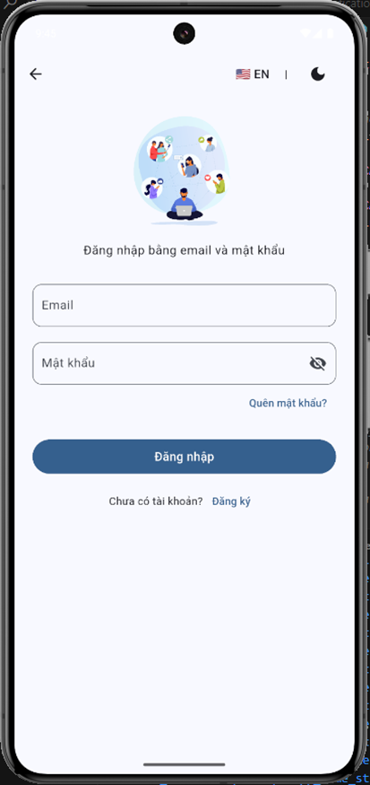
  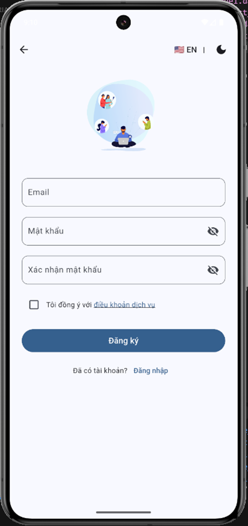
</p>

### Dòng thời gian và đăng bài
<p align="center">
  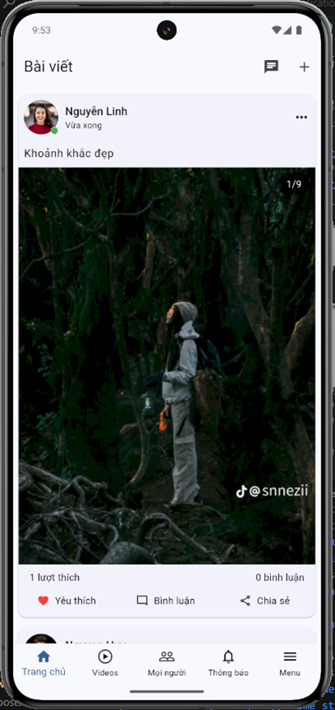
  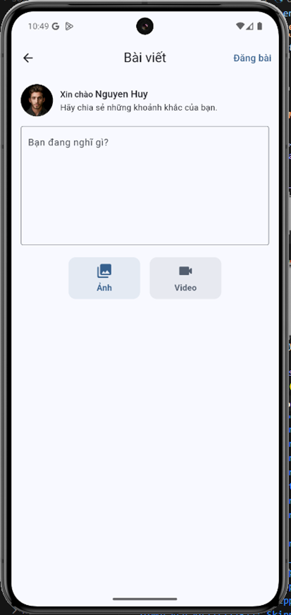
</p>

### Hồ sơ và bạn bè
<p align="center">
  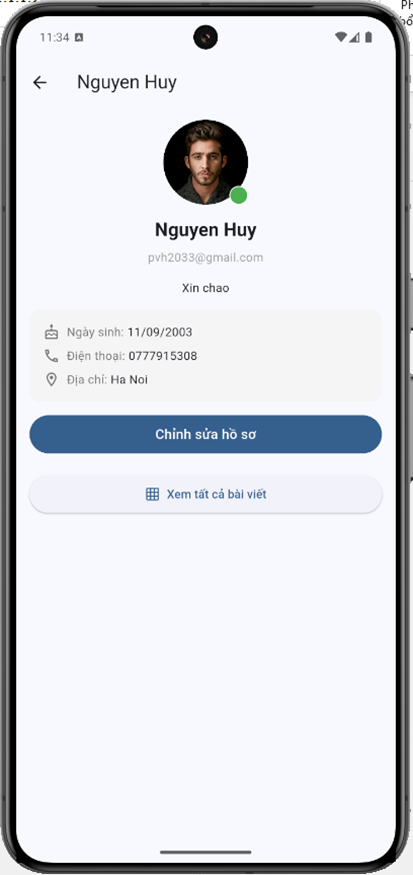
  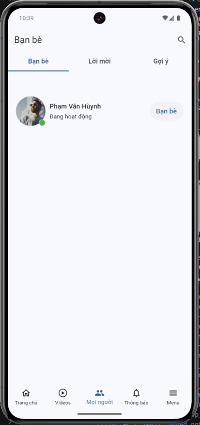
</p>

### Trò chuyện và nhóm
<p align="center">
  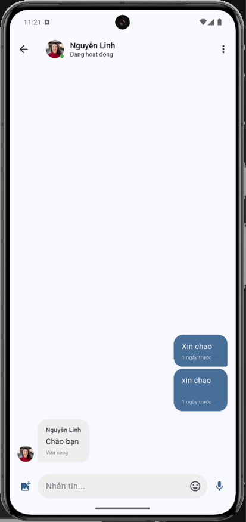
  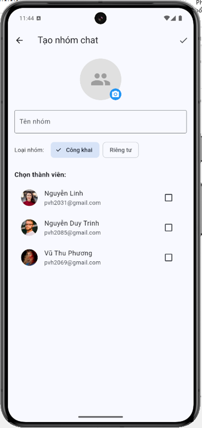
</p>

### Thông báo và video
<p align="center">
  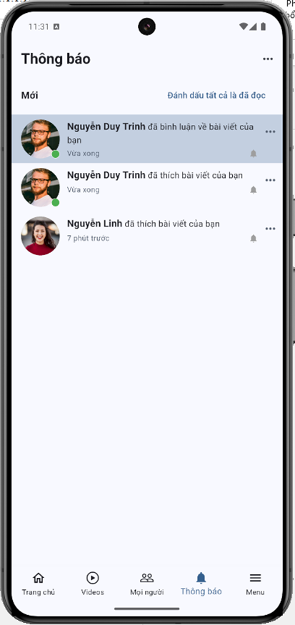
  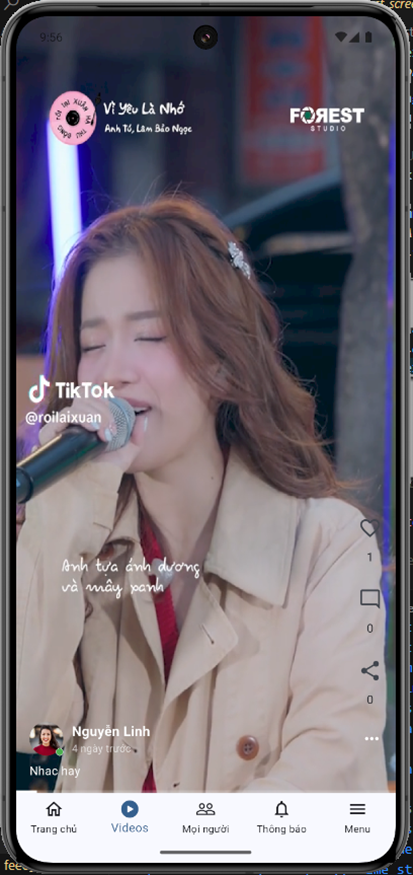
</p>

### Cài đặt
<p align="center">
  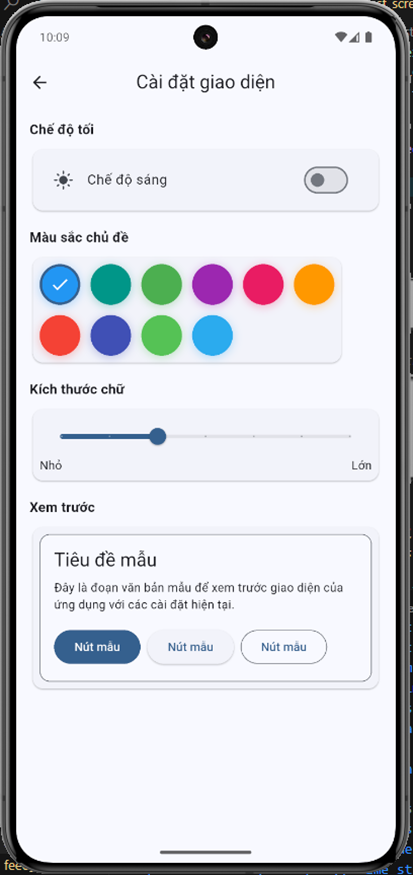
</p>

## ✨ Tính năng chính

- **Xác thực người dùng**: Đăng nhập/đăng ký bằng email, Google, Facebook
- **Hồ sơ cá nhân**: Tùy chỉnh thông tin, ảnh đại diện, tiểu sử
- **Bài đăng**: Chia sẻ nội dung với hình ảnh, video, văn bản
- **Tương tác xã hội**: Thích, bình luận, chia sẻ bài viết
- **Nhắn tin trực tiếp**: Trò chuyện 1-1 và nhóm với hỗ trợ tin nhắn văn bản, hình ảnh, âm thanh và video
- **Thông báo**: Nhận thông báo thời gian thực về các hoạt động liên quan
- **Kết bạn**: Tìm kiếm, kết bạn và quản lý danh sách bạn bè
- **Đa ngôn ngữ**: Hỗ trợ tiếng Anh và tiếng Việt
- **Chế độ tối/sáng**: Tùy chỉnh giao diện theo sở thích người dùng

## 🚀 Công nghệ sử dụng

- **Framework**: Flutter
- **Quản lý trạng thái**: Flutter Riverpod
- **Backend**: Firebase (Authentication, Firestore, Storage, Messaging)
- **Ngôn ngữ lập trình**: Dart
- **Đa ngôn ngữ**: Easy Localization
- **Giao diện người dùng**: Material Design, Animations
- **Xử lý đa phương tiện**: image_picker, image_cropper, cached_network_image, video_player

## 📱 Cài đặt

### Yêu cầu hệ thống
- Flutter SDK ≥ 3.1.3
- Dart SDK ≥ 3.0.0
- Android Studio / VS Code
- Thiết bị iOS hoặc Android (thực tế hoặc giả lập)

### Các bước cài đặt

1. Clone repo:
```bash
git clone https://github.com/username/social_app.git
cd social_app
```

2. Cài đặt các dependencies:
```bash
flutter pub get
```

3. Thiết lập Firebase:
   - Tạo dự án Firebase mới
   - Thêm các ứng dụng (Android, iOS, Web) vào dự án
   - Tải file cấu hình và đặt vào vị trí thích hợp
   - Bật các dịch vụ cần thiết (Authentication, Firestore, Storage, Messaging)

4. Chạy ứng dụng:
```bash
flutter run
```

## 🏗️ Kiến trúc dự án

```
lib/
├── core/                  # Thành phần cốt lõi, tiện ích, helpers
├── features/              # Các tính năng của ứng dụng
│   ├── authentication/    # Xác thực người dùng
│   ├── profile/           # Hồ sơ người dùng
│   ├── posts/             # Bài đăng và feed
│   ├── chat/              # Nhắn tin và trò chuyện
│   ├── friends/           # Quản lý bạn bè
│   ├── notification/      # Thông báo
│   └── settings/          # Cài đặt ứng dụng
├── firebase_options.dart  # Cấu hình Firebase
└── main.dart              # Điểm khởi đầu ứng dụng
```

## 📄 Giấy phép

Dự án này được cấp phép theo [LICENSE_NAME] - xem file LICENSE để biết thêm chi tiết.

## 👥 Tác giả

- **Tên Tác Giả** - [@username](https://github.com/username)

## 🙏 Lời cảm ơn

- Cảm ơn cộng đồng Flutter vì những hướng dẫn và nguồn tài nguyên tuyệt vời
- Các thư viện mã nguồn mở đã được sử dụng trong dự án

---

<p align="center">
  <strong>Made with ❤️ by [Tên Team/Cá nhân]</strong>
</p>
