# Biểu đồ hoạt động cho ứng dụng mạng xã hội

## Chức năng Đăng ký

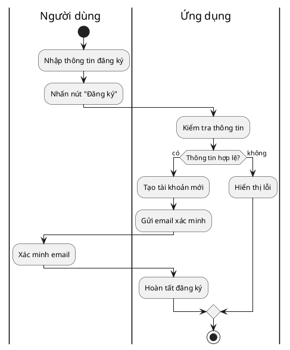

## Chức năng Đăng nhập

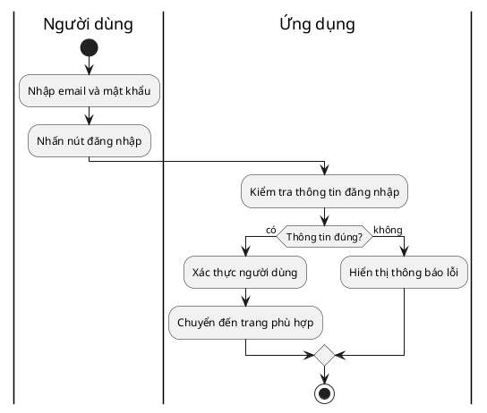

## Chức năng Nhắn tin

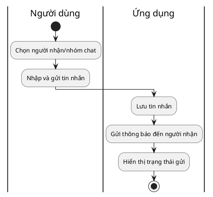

## Chức năng Xem thông báo

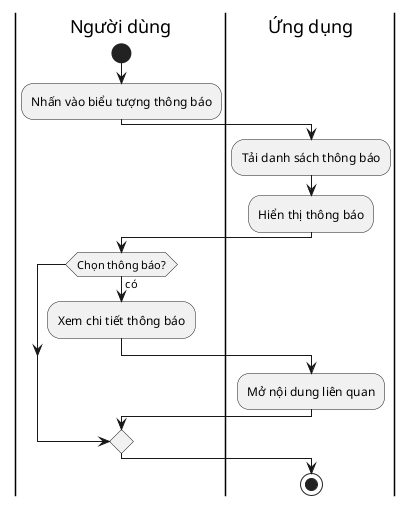

## Chức năng Quản lý thông tin cá nhân

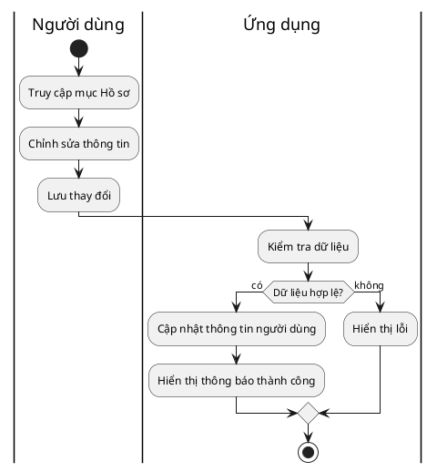

## Chức năng Thêm bài viết

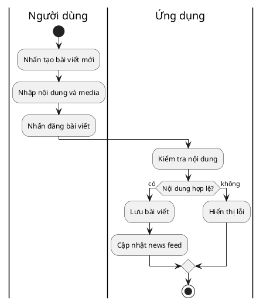

## Chức năng Chỉnh sửa bài viết

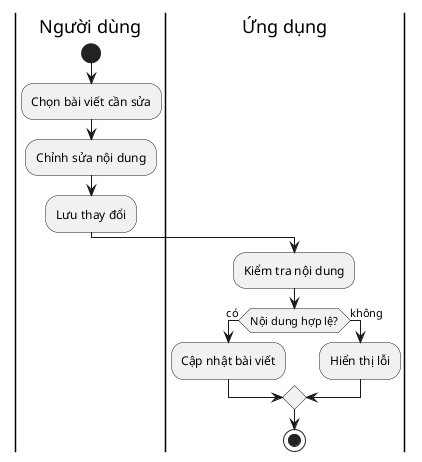

## Chức năng Xóa bài viết

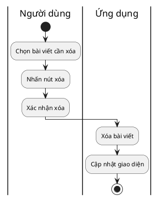

## Chức năng Kết bạn

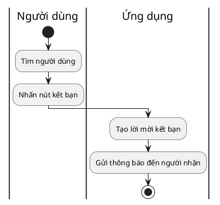

## Chức năng Đồng ý kết bạn

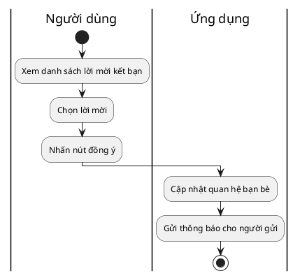

## Chức năng Xóa bạn bè

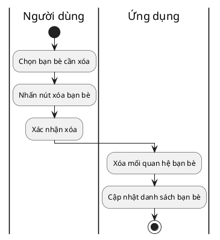

## Chức năng Tạo nhóm chat

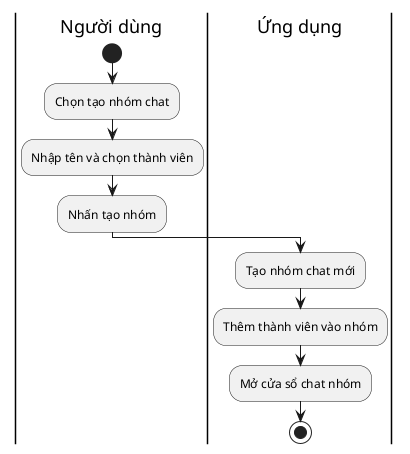

## Chức năng Sửa nhóm chat

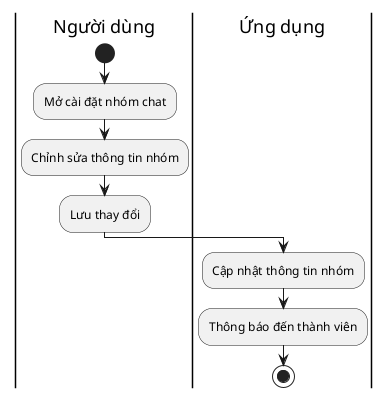

## Chức năng Xóa nhóm chat

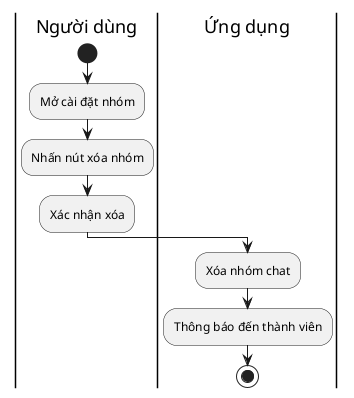