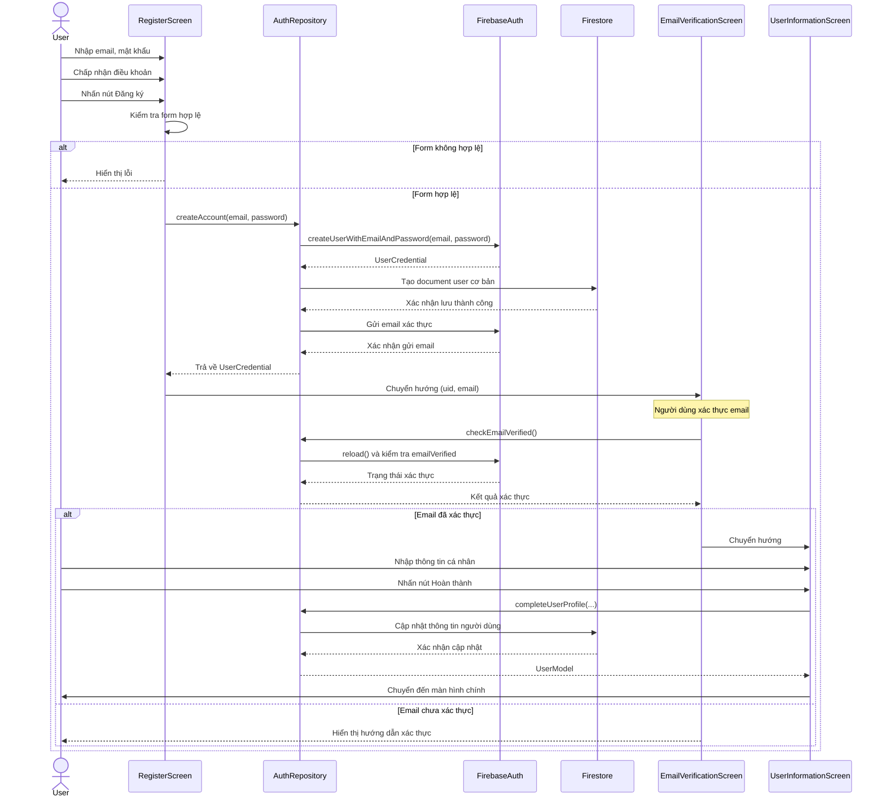

```mermaid
sequenceDiagram
    actor User
    participant RegisterScreen
    participant AuthRepository
    participant FirebaseAuth
    participant Firestore
    participant EmailVerificationScreen
    participant UserInformationScreen
    
    User->>RegisterScreen: Nhập email, mật khẩu
    User->>RegisterScreen: Chấp nhận điều khoản
    User->>RegisterScreen: Nhấn nút Đăng ký
    
    RegisterScreen->>RegisterScreen: Kiểm tra form hợp lệ
    
    alt Form không hợp lệ
        RegisterScreen-->>User: Hiển thị lỗi
    else Form hợp lệ
        RegisterScreen->>AuthRepository: createAccount(email, password)
        
        AuthRepository->>FirebaseAuth: createUserWithEmailAndPassword(email, password)
        FirebaseAuth-->>AuthRepository: UserCredential
        
        AuthRepository->>Firestore: Tạo document user cơ bản
        Firestore-->>AuthRepository: Xác nhận lưu thành công
        
        AuthRepository->>FirebaseAuth: Gửi email xác thực
        FirebaseAuth-->>AuthRepository: Xác nhận gửi email
        
        AuthRepository-->>RegisterScreen: Trả về UserCredential
        
        RegisterScreen->>EmailVerificationScreen: Chuyển hướng (uid, email)
        
        Note over EmailVerificationScreen: Người dùng xác thực email
        
        EmailVerificationScreen->>AuthRepository: checkEmailVerified()
        AuthRepository->>FirebaseAuth: reload() và kiểm tra emailVerified
        FirebaseAuth-->>AuthRepository: Trạng thái xác thực
        AuthRepository-->>EmailVerificationScreen: Kết quả xác thực
        
        alt Email đã xác thực
            EmailVerificationScreen->>UserInformationScreen: Chuyển hướng
            
            User->>UserInformationScreen: Nhập thông tin cá nhân
            User->>UserInformationScreen: Nhấn nút Hoàn thành
            
            UserInformationScreen->>AuthRepository: completeUserProfile(...)
            AuthRepository->>Firestore: Cập nhật thông tin người dùng
            Firestore-->>AuthRepository: Xác nhận cập nhật
            AuthRepository-->>UserInformationScreen: UserModel
            
            UserInformationScreen->>User: Chuyển đến màn hình chính
        else Email chưa xác thực
            EmailVerificationScreen-->>User: Hiển thị hướng dẫn xác thực
        end
    end
``` 