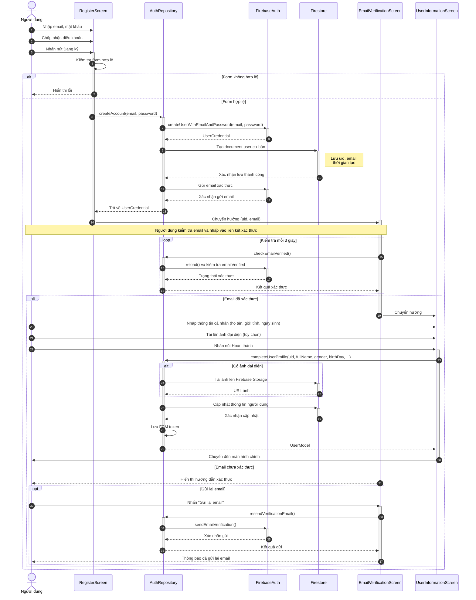

```mermaid
sequenceDiagram
    autonumber
    actor User as Người dùng
    participant RS as RegisterScreen
    participant AR as AuthRepository
    participant FA as FirebaseAuth
    participant FS as Firestore
    participant EVS as EmailVerificationScreen
    participant UIS as UserInformationScreen
    
    User->>RS: Nhập email, mật khẩu
    User->>RS: Chấp nhận điều khoản
    User->>RS: Nhấn nút Đăng ký
    
    activate RS
    RS->>RS: Kiểm tra form hợp lệ
    
    alt Form không hợp lệ
        RS-->>User: Hiển thị lỗi
    else Form hợp lệ
        RS->>+AR: createAccount(email, password)
        
        AR->>+FA: createUserWithEmailAndPassword(email, password)
        FA-->>-AR: UserCredential
        
        AR->>+FS: Tạo document user cơ bản
        Note right of FS: Lưu uid, email, <br/>thời gian tạo
        FS-->>-AR: Xác nhận lưu thành công
        
        AR->>+FA: Gửi email xác thực
        FA-->>-AR: Xác nhận gửi email
        
        AR-->>-RS: Trả về UserCredential
        
        RS->>+EVS: Chuyển hướng (uid, email)
        deactivate RS
        
        Note over User,EVS: Người dùng kiểm tra email và nhấp vào liên kết xác thực
        
        loop Kiểm tra mỗi 3 giây
            EVS->>+AR: checkEmailVerified()
            AR->>+FA: reload() và kiểm tra emailVerified
            FA-->>-AR: Trạng thái xác thực
            AR-->>-EVS: Kết quả xác thực
        end
        
        alt Email đã xác thực
            EVS->>+UIS: Chuyển hướng
            deactivate EVS
            
            User->>UIS: Nhập thông tin cá nhân (họ tên, giới tính, ngày sinh)
            User->>UIS: Tải lên ảnh đại diện (tùy chọn)
            User->>UIS: Nhấn nút Hoàn thành
            
            activate UIS
            UIS->>+AR: completeUserProfile(uid, fullName, gender, birthDay, ...)
            
            alt Có ảnh đại diện
                AR->>+FS: Tải ảnh lên Firebase Storage
                FS-->>-AR: URL ảnh
            end
            
            AR->>+FS: Cập nhật thông tin người dùng
            FS-->>-AR: Xác nhận cập nhật
            
            AR->>AR: Lưu FCM token
            
            AR-->>-UIS: UserModel
            
            UIS->>User: Chuyển đến màn hình chính
            deactivate UIS
        else Email chưa xác thực
            EVS-->>User: Hiển thị hướng dẫn xác thực
            
            opt Gửi lại email
                User->>EVS: Nhấn "Gửi lại email"
                activate EVS
                EVS->>+AR: resendVerificationEmail()
                AR->>+FA: sendEmailVerification()
                FA-->>-AR: Xác nhận gửi
                AR-->>-EVS: Kết quả gửi
                EVS-->>User: Thông báo đã gửi lại email
                deactivate EVS
            end
        end
    end
``` 