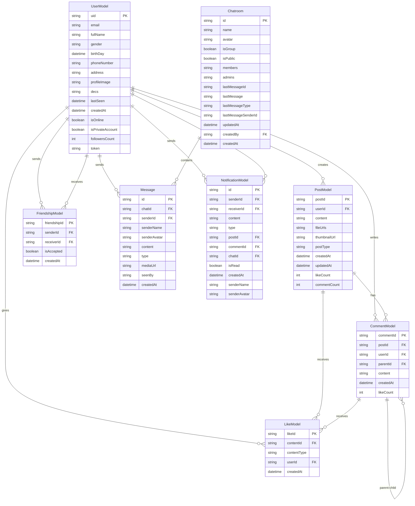

```mermaid
erDiagram
    UserModel ||--o{ PostModel : creates
    UserModel ||--o{ CommentModel : writes
    UserModel ||--o{ LikeModel : gives
    UserModel ||--o{ FriendshipModel : sends
    UserModel ||--o{ FriendshipModel : receives
    UserModel ||--o{ Message : sends
    UserModel ||--o{ NotificationModel : sends
    UserModel ||--o{ NotificationModel : receives
    
    PostModel ||--o{ CommentModel : has
    PostModel ||--o{ LikeModel : receives
    
    CommentModel ||--o{ LikeModel : receives
    CommentModel ||--o{ CommentModel : "parent-child"
    
    Chatroom ||--o{ Message : contains

    UserModel {
        string uid PK
        string email
        string fullName
        string gender
        datetime birthDay
        string phoneNumber
        string address
        string profileImage
        string decs
        datetime lastSeen
        datetime createdAt
        boolean isOnline
        boolean isPrivateAccount
        int followersCount
        string token
    }

    PostModel {
        string postId PK
        string userId FK
        string content
        string fileUrls
        string thumbnailUrl
        string postType
        datetime createdAt
        datetime updatedAt
        int likeCount
        int commentCount
    }

    CommentModel {
        string commentId PK
        string postId FK
        string userId FK
        string parentId FK
        string content
        datetime createdAt
        int likeCount
    }

    LikeModel {
        string likeId PK
        string contentId FK
        string contentType
        string userId FK
        datetime createdAt
    }

    FriendshipModel {
        string friendshipId PK
        string senderId FK
        string receiverId FK
        boolean isAccepted
        datetime createdAt
    }

    Message {
        string id PK
        string chatId FK
        string senderId FK
        string senderName
        string senderAvatar
        string content
        string type
        string mediaUrl
        string seenBy
        datetime createdAt
    }

    Chatroom {
        string id PK
        string name
        string avatar
        boolean isGroup
        boolean isPublic
        string members
        string admins
        string lastMessageId
        string lastMessage
        string lastMessageType
        string lastMessageSenderId
        datetime updatedAt
        string createdBy FK
        datetime createdAt
    }

    NotificationModel {
        string id PK
        string senderId FK
        string receiverId FK
        string content
        string type
        string postId FK
        string commentId FK
        string chatId FK
        boolean isRead
        datetime createdAt
        string senderName
        string senderAvatar
    }
``` 