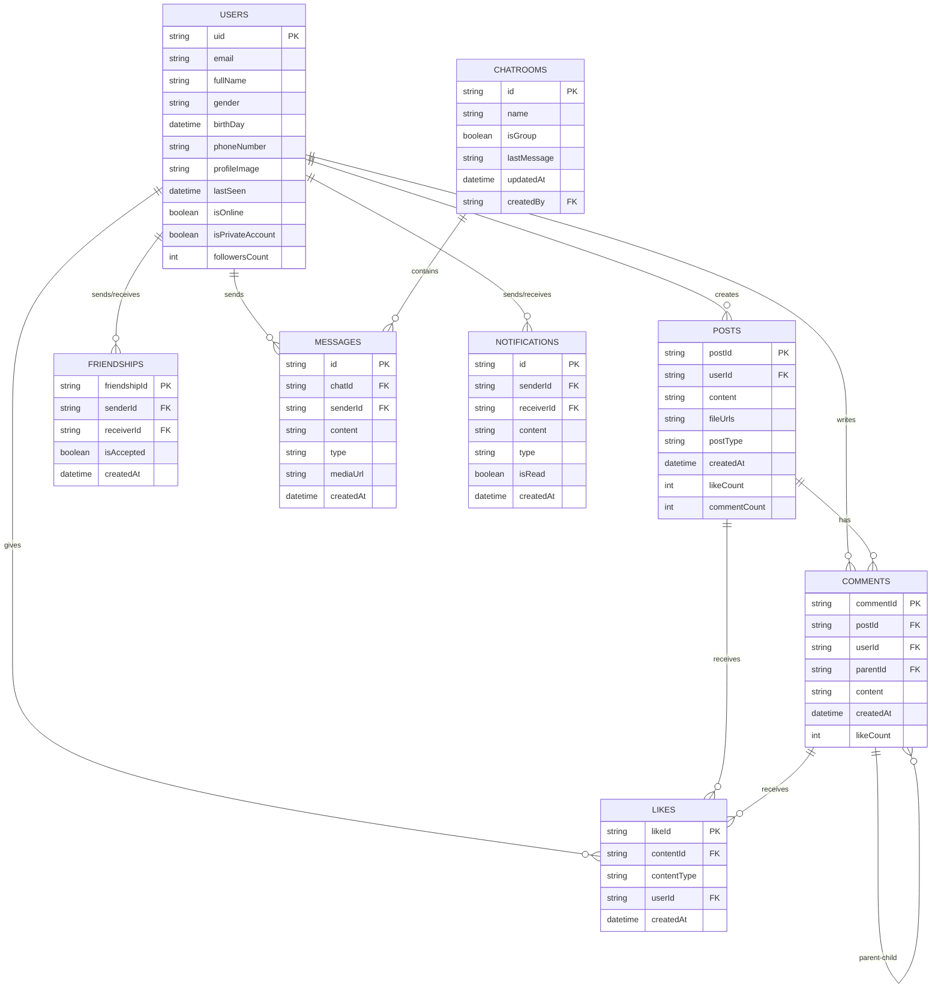

```mermaid
erDiagram
    USERS ||--o{ POSTS : creates
    USERS ||--o{ COMMENTS : writes
    USERS ||--o{ LIKES : gives
    USERS ||--o{ FRIENDSHIPS : "sends/receives"
    USERS ||--o{ MESSAGES : sends
    USERS ||--o{ NOTIFICATIONS : "sends/receives"
    
    POSTS ||--o{ COMMENTS : has
    POSTS ||--o{ LIKES : receives
    
    COMMENTS ||--o{ LIKES : receives
    COMMENTS ||--o{ COMMENTS : "parent-child"
    
    CHATROOMS ||--o{ MESSAGES : contains

    USERS {
        string uid PK
        string email
        string fullName
        string gender
        datetime birthDay
        string phoneNumber
        string profileImage
        datetime lastSeen
        boolean isOnline
        boolean isPrivateAccount
        int followersCount
    }

    POSTS {
        string postId PK
        string userId FK
        string content
        string fileUrls
        string postType
        datetime createdAt
        int likeCount
        int commentCount
    }

    COMMENTS {
        string commentId PK
        string postId FK
        string userId FK
        string parentId FK
        string content
        datetime createdAt
        int likeCount
    }

    LIKES {
        string likeId PK
        string contentId FK
        string contentType
        string userId FK
        datetime createdAt
    }

    FRIENDSHIPS {
        string friendshipId PK
        string senderId FK
        string receiverId FK
        boolean isAccepted
        datetime createdAt
    }

    MESSAGES {
        string id PK
        string chatId FK
        string senderId FK
        string content
        string type
        string mediaUrl
        datetime createdAt
    }

    CHATROOMS {
        string id PK
        string name
        boolean isGroup
        string lastMessage
        datetime updatedAt
        string createdBy FK
    }

    NOTIFICATIONS {
        string id PK
        string senderId FK
        string receiverId FK
        string content
        string type
        boolean isRead
        datetime createdAt
    }
``` 