# Biểu Đồ Activity Cho Ứng Dụng Social App - PlantUML

Tài liệu này chứa các biểu đồ activity mô tả luồng hoạt động của các chức năng chính trong ứng dụng Social App, được tạo bằng cú pháp PlantUML.

## 1. Biểu Đồ Activity - Đăng Ký Tài Khoản

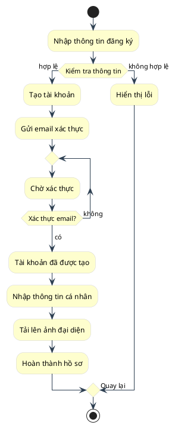

## 2. Biểu Đồ Activity - Đăng Nhập

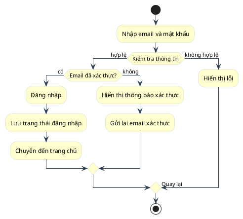

## 3. Biểu Đồ Activity - Tạo Bài Viết

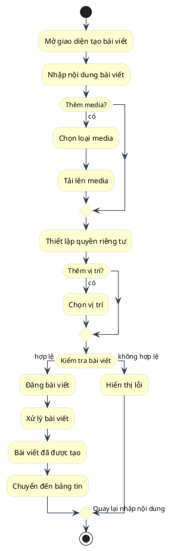

## 4. Biểu Đồ Activity - Gửi Lời Mời Kết Bạn

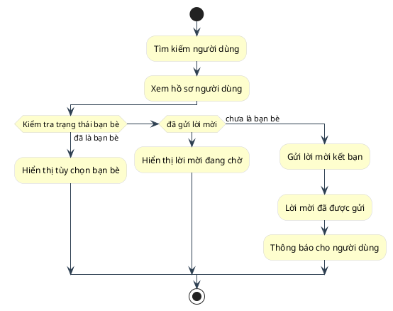

## 5. Biểu Đồ Activity - Chấp Nhận Lời Mời Kết Bạn

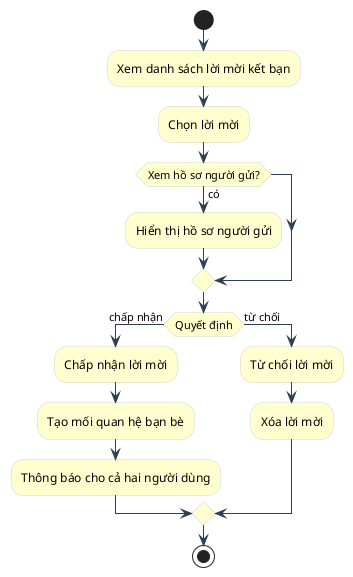

## 6. Biểu Đồ Activity - Gửi Tin Nhắn

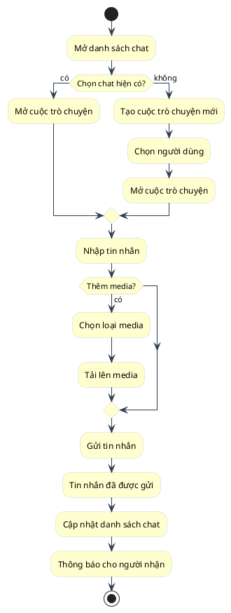

## 7. Biểu Đồ Activity - Tạo Nhóm Chat

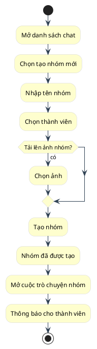

## 8. Biểu Đồ Activity - Xem Thông Báo

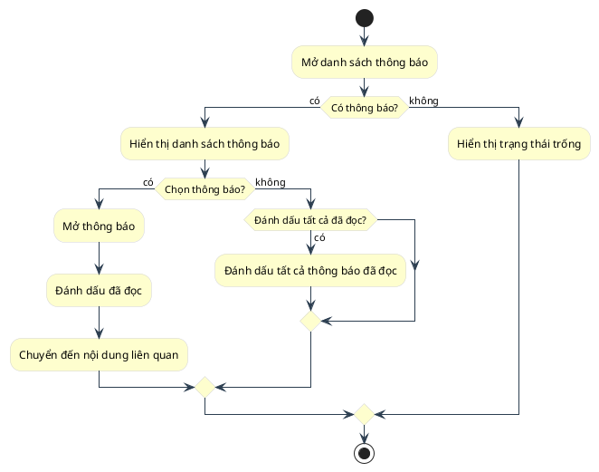

## 9. Biểu Đồ Activity - Chỉnh Sửa Hồ Sơ

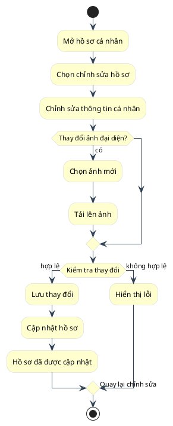

## 10. Biểu Đồ Activity - Xóa Bài Viết

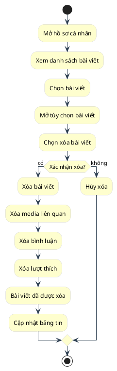

## 11. Biểu Đồ Activity - Quản Lý Nhóm Chat

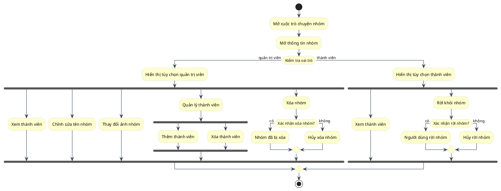

## 12. Biểu Đồ Activity - Tìm Kiếm Người Dùng

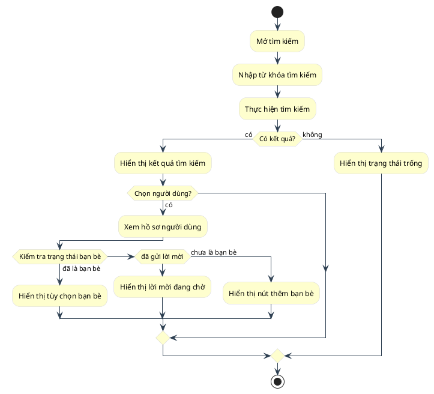

## 13. Biểu Đồ Activity - Bình Luận Bài Viết

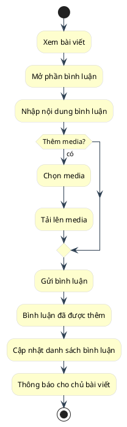

## 14. Biểu Đồ Activity - Cài Đặt Quyền Riêng Tư

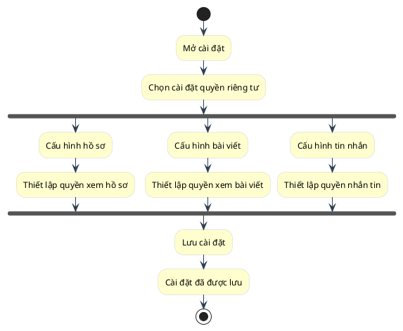

## 15. Biểu Đồ Activity - Xem Bảng Tin

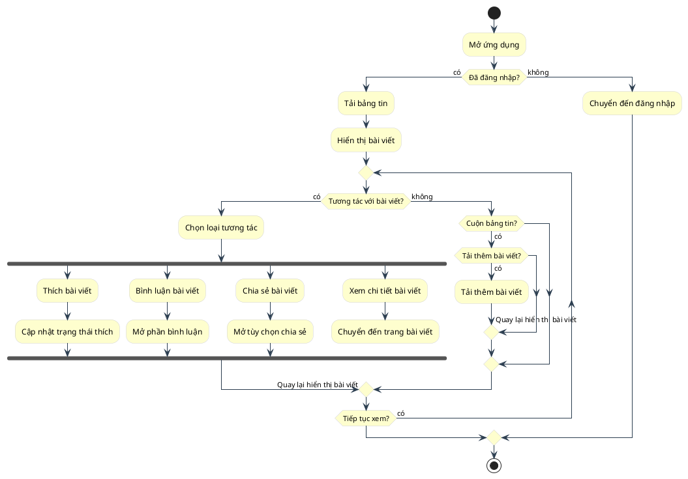