# Sơ Đồ Lớp (Class Diagram) Cho Ứng Dụng Social App

Tài liệu này chứa sơ đồ lớp cho ứng dụng Social App, được biểu diễn bằng cả PlantUML và Mermaid.

## Sơ Đồ Lớp Tổng Quan

### PlantUML

```plantuml
@startuml
package "Models" {
  class User {
    - String id
    - String email
    - String displayName
    - String avatarUrl
    - String bio
    - DateTime createdAt
    - DateTime lastActive
    - bool isOnline
    - String fcmToken
    + Map<String, dynamic> toMap()
    + factory User.fromMap(Map<String, dynamic>)
  }
  
  class Post {
    - String id
    - String userId
    - String content
    - List<String> mediaUrls
    - DateTime createdAt
    - DateTime? editedAt
    - int likeCount
    - int commentCount
    + Map<String, dynamic> toMap()
    + factory Post.fromMap(Map<String, dynamic>)
  }
  
  class Comment {
    - String id
    - String postId
    - String userId
    - String content
    - DateTime createdAt
    + Map<String, dynamic> toMap()
    + factory Comment.fromMap(Map<String, dynamic>)
  }
  
  class Chat {
    - String id
    - List<String> participantIds
    - String? groupName
    - String? groupAvatarUrl
    - bool isGroup
    - DateTime lastMessageTime
    - String lastMessageText
    - String lastMessageSenderId
    + Map<String, dynamic> toMap()
    + factory Chat.fromMap(Map<String, dynamic>)
  }
  
  class Message {
    - String id
    - String chatId
    - String senderId
    - String? content
    - String? mediaUrl
    - String? mediaType
    - bool isSystemMessage
    - DateTime createdAt
    - bool isRead
    + Map<String, dynamic> toMap()
    + factory Message.fromMap(Map<String, dynamic>)
  }
  
  class FriendRequest {
    - String id
    - String senderId
    - String recipientId
    - DateTime createdAt
    - String status
    + Map<String, dynamic> toMap()
    + factory FriendRequest.fromMap(Map<String, dynamic>)
  }
  
  class Notification {
    - String id
    - String userId
    - String type
    - String? senderId
    - String? postId
    - String? commentId
    - String? chatId
    - String? content
    - DateTime createdAt
    - bool isRead
    + Map<String, dynamic> toMap()
    + factory Notification.fromMap(Map<String, dynamic>)
  }
}

package "Repositories" {
  class AuthRepository {
    - FirebaseAuth _firebaseAuth
    - FirebaseFirestore _firestore
    - FirebaseStorage _storage
    + Future<UserCredential> registerUser(String email, String password)
    + Future<void> sendEmailVerification()
    + Future<void> createUserDocument(String userId, Map<String, dynamic> data)
    + Future<UserCredential> loginUser(String email, String password)
    + Future<void> logoutUser()
    + Future<void> updateUserProfile(String userId, Map<String, dynamic> data, File? avatar)
    + Future<void> updateUserStatus(String userId, bool isOnline)
    + Future<void> updateFCMToken(String userId, String token)
    + Future<void> resetPassword(String email)
  }
  
  class PostRepository {
    - FirebaseFirestore _firestore
    - FirebaseStorage _storage
    + Future<List<Post>> getPosts(String userId, int limit, String? lastPostId)
    + Future<Post> getPost(String postId)
    + Future<String> createPost(String userId, String content, List<File>? mediaFiles)
    + Future<void> updatePost(String postId, String newContent)
    + Future<void> deletePost(String postId)
    + Future<void> likePost(String postId, String userId)
    + Future<void> unlikePost(String postId, String userId)
    + Future<List<Comment>> getComments(String postId, int limit, String? lastCommentId)
    + Future<String> addComment(String postId, String userId, String content)
    + Future<void> deleteComment(String commentId)
  }
  
  class ChatRepository {
    - FirebaseFirestore _firestore
    - FirebaseStorage _storage
    + Future<List<Chat>> getChats(String userId)
    + Future<Chat> getChat(String chatId)
    + Future<String> createChat(List<String> participantIds)
    + Future<String> createGroupChat(String name, List<String> members, String creatorId, File? avatar)
    + Future<List<Message>> getMessages(String chatId, int limit, String? lastMessageId)
    + Future<String> sendMessage(String chatId, String content, String senderId)
    + Future<String> sendMediaMessage(String chatId, File file, String senderId)
    + Future<void> markMessagesAsRead(String chatId, String userId)
    + Future<void> addMember(String chatId, String userId)
    + Future<void> removeMember(String chatId, String userId)
    + Future<void> leaveGroup(String chatId, String userId)
  }
  
  class UserRepository {
    - FirebaseFirestore _firestore
    - FirebaseStorage _storage
    + Future<User> getUserProfile(String userId)
    + Future<List<User>> searchUsers(String query)
    + Future<List<User>> getFriends(String userId)
    + Future<void> sendFriendRequest(String currentUserId, String targetUserId)
    + Future<List<FriendRequest>> getFriendRequests(String userId)
    + Future<void> acceptFriendRequest(String requestId, String currentUserId, String senderId)
    + Future<void> rejectFriendRequest(String requestId)
    + Future<void> removeFriend(String currentUserId, String friendId)
  }
  
  class NotificationRepository {
    - FirebaseFirestore _firestore
    + Future<List<Notification>> getNotifications(String userId, int limit, String? lastNotificationId)
    + Future<void> markNotificationAsRead(String notificationId)
    + Future<void> markAllNotificationsAsRead(String userId)
    + Future<void> createNotification(Map<String, dynamic> notificationData)
    + Future<void> deleteNotification(String notificationId)
  }
}

package "Providers" {
  class AuthProvider {
    - AuthRepository _authRepository
    - User? _currentUser
    - AuthStatus _status
    + User? get currentUser
    + AuthStatus get status
    + Future<void> registerUser(String email, String password)
    + Future<void> loginUser(String email, String password)
    + Future<void> logoutUser()
    + Future<void> updateUserProfile(Map<String, dynamic> data, File? avatar)
    + Future<void> resetPassword(String email)
  }
  
  class PostsProvider {
    - PostRepository _postRepository
    - List<Post> _posts
    - bool _hasMore
    - bool _isLoading
    + List<Post> get posts
    + bool get hasMore
    + bool get isLoading
    + Future<void> getPosts(int limit, String? lastPostId)
    + Future<void> refreshPosts()
    + Future<void> loadMorePosts()
    + Future<void> createPost(String content, List<File>? mediaFiles)
    + Future<void> updatePost(String postId, String newContent)
    + Future<void> deletePost(String postId)
    + Future<void> likePost(String postId)
    + Future<void> unlikePost(String postId)
  }
  
  class ChatProvider {
    - ChatRepository _chatRepository
    - List<Chat> _chats
    - Chat? _currentChat
    - List<Message> _messages
    - bool _hasMore
    - bool _isLoading
    + List<Chat> get chats
    + Chat? get currentChat
    + List<Message> get messages
    + bool get hasMore
    + bool get isLoading
    + Future<void> getChats()
    + Future<void> setCurrentChat(String chatId)
    + Future<void> getMessages(int limit, String? lastMessageId)
    + Future<void> loadMoreMessages()
    + Future<void> sendMessage(String content)
    + Future<void> sendMediaMessage(File file)
    + Future<void> createChat(String userId)
    + Future<void> createGroupChat(String name, List<String> members, File? avatar)
    + Future<void> markMessagesAsRead()
    + Future<void> addMember(String userId)
    + Future<void> removeMember(String userId)
    + Future<void> leaveGroup()
  }
  
  class ProfileProvider {
    - UserRepository _userRepository
    - PostRepository _postRepository
    - User? _user
    - List<Post> _userPosts
    - bool _hasMore
    - bool _isLoading
    + User? get user
    + List<Post> get userPosts
    + bool get hasMore
    + bool get isLoading
    + Future<void> getUserProfile(String userId)
    + Future<void> getUserPosts(String userId, int limit, String? lastPostId)
    + Future<void> loadMoreUserPosts()
    + Future<void> updateProfile(Map<String, dynamic> profileData, File? newAvatar)
  }
  
  class FriendsProvider {
    - UserRepository _userRepository
    - List<User> _friends
    - List<FriendRequest> _friendRequests
    - List<User> _searchResults
    - bool _isLoading
    + List<User> get friends
    + List<FriendRequest> get friendRequests
    + List<User> get searchResults
    + bool get isLoading
    + Future<void> getFriends()
    + Future<void> getFriendRequests()
    + Future<void> searchUsers(String query)
    + Future<void> sendFriendRequest(String targetUserId)
    + Future<void> acceptFriendRequest(String requestId, String senderId)
    + Future<void> rejectFriendRequest(String requestId)
    + Future<void> removeFriend(String friendId)
  }
  
  class NotificationProvider {
    - NotificationRepository _notificationRepository
    - List<Notification> _notifications
    - bool _hasMore
    - bool _isLoading
    + List<Notification> get notifications
    + bool get hasMore
    + bool get isLoading
    + Future<void> getNotifications(int limit, String? lastNotificationId)
    + Future<void> loadMoreNotifications()
    + Future<void> markNotificationAsRead(String notificationId)
    + Future<void> markAllNotificationsAsRead()
  }
}

package "Screens" {
  class SplashScreen
  class RegisterScreen
  class LoginScreen
  class HomeScreen
  class FeedScreen
  class ChatListScreen
  class ChatScreen
  class CreatePostScreen
  class PostDetailScreen
  class ProfileScreen
  class EditProfileScreen
  class FriendsScreen
  class NotificationsScreen
  class SearchScreen
  class GroupInfoScreen
  class CreateGroupScreen
}

' Relationships
User "1" -- "0..*" Post : creates >
User "1" -- "0..*" Comment : writes >
User "1" -- "0..*" Message : sends >
User "1" -- "0..*" FriendRequest : sends/receives >
User "1" -- "0..*" Notification : receives >
User "1" -- "0..*" Chat : participates >

Post "1" -- "0..*" Comment : has >
Chat "1" -- "0..*" Message : contains >
Chat "1" -- "2..*" User : involves >

AuthRepository -- AuthProvider : uses >
PostRepository -- PostsProvider : uses >
ChatRepository -- ChatProvider : uses >
UserRepository -- ProfileProvider : uses >
UserRepository -- FriendsProvider : uses >
NotificationRepository -- NotificationProvider : uses >

@enduml
```

### Mermaid

```mermaid
classDiagram
    %% Models
    class User {
        -String id
        -String email
        -String displayName
        -String avatarUrl
        -String bio
        -DateTime createdAt
        -DateTime lastActive
        -bool isOnline
        -String fcmToken
        +toMap() Map~String,dynamic~
        +fromMap(Map~String,dynamic~) User
    }
    
    class Post {
        -String id
        -String userId
        -String content
        -List~String~ mediaUrls
        -DateTime createdAt
        -DateTime? editedAt
        -int likeCount
        -int commentCount
        +toMap() Map~String,dynamic~
        +fromMap(Map~String,dynamic~) Post
    }
    
    class Comment {
        -String id
        -String postId
        -String userId
        -String content
        -DateTime createdAt
        +toMap() Map~String,dynamic~
        +fromMap(Map~String,dynamic~) Comment
    }
    
    class Chat {
        -String id
        -List~String~ participantIds
        -String? groupName
        -String? groupAvatarUrl
        -bool isGroup
        -DateTime lastMessageTime
        -String lastMessageText
        -String lastMessageSenderId
        +toMap() Map~String,dynamic~
        +fromMap(Map~String,dynamic~) Chat
    }
    
    class Message {
        -String id
        -String chatId
        -String senderId
        -String? content
        -String? mediaUrl
        -String? mediaType
        -bool isSystemMessage
        -DateTime createdAt
        -bool isRead
        +toMap() Map~String,dynamic~
        +fromMap(Map~String,dynamic~) Message
    }
    
    class FriendRequest {
        -String id
        -String senderId
        -String recipientId
        -DateTime createdAt
        -String status
        +toMap() Map~String,dynamic~
        +fromMap(Map~String,dynamic~) FriendRequest
    }
    
    class Notification {
        -String id
        -String userId
        -String type
        -String? senderId
        -String? postId
        -String? commentId
        -String? chatId
        -String? content
        -DateTime createdAt
        -bool isRead
        +toMap() Map~String,dynamic~
        +fromMap(Map~String,dynamic~) Notification
    }
    
    %% Repositories
    class AuthRepository {
        -FirebaseAuth _firebaseAuth
        -FirebaseFirestore _firestore
        -FirebaseStorage _storage
        +registerUser(String email, String password) Future~UserCredential~
        +sendEmailVerification() Future~void~
        +createUserDocument(String userId, Map~String,dynamic~ data) Future~void~
        +loginUser(String email, String password) Future~UserCredential~
        +logoutUser() Future~void~
        +updateUserProfile(String userId, Map~String,dynamic~ data, File? avatar) Future~void~
        +updateUserStatus(String userId, bool isOnline) Future~void~
        +updateFCMToken(String userId, String token) Future~void~
        +resetPassword(String email) Future~void~
    }
    
    class PostRepository {
        -FirebaseFirestore _firestore
        -FirebaseStorage _storage
        +getPosts(String userId, int limit, String? lastPostId) Future~List~Post~~
        +getPost(String postId) Future~Post~
        +createPost(String userId, String content, List~File~? mediaFiles) Future~String~
        +updatePost(String postId, String newContent) Future~void~
        +deletePost(String postId) Future~void~
        +likePost(String postId, String userId) Future~void~
        +unlikePost(String postId, String userId) Future~void~
        +getComments(String postId, int limit, String? lastCommentId) Future~List~Comment~~
        +addComment(String postId, String userId, String content) Future~String~
        +deleteComment(String commentId) Future~void~
    }
    
    class ChatRepository {
        -FirebaseFirestore _firestore
        -FirebaseStorage _storage
        +getChats(String userId) Future~List~Chat~~
        +getChat(String chatId) Future~Chat~
        +createChat(List~String~ participantIds) Future~String~
        +createGroupChat(String name, List~String~ members, String creatorId, File? avatar) Future~String~
        +getMessages(String chatId, int limit, String? lastMessageId) Future~List~Message~~
        +sendMessage(String chatId, String content, String senderId) Future~String~
        +sendMediaMessage(String chatId, File file, String senderId) Future~String~
        +markMessagesAsRead(String chatId, String userId) Future~void~
        +addMember(String chatId, String userId) Future~void~
        +removeMember(String chatId, String userId) Future~void~
        +leaveGroup(String chatId, String userId) Future~void~
    }
    
    class UserRepository {
        -FirebaseFirestore _firestore
        -FirebaseStorage _storage
        +getUserProfile(String userId) Future~User~
        +searchUsers(String query) Future~List~User~~
        +getFriends(String userId) Future~List~User~~
        +sendFriendRequest(String currentUserId, String targetUserId) Future~void~
        +getFriendRequests(String userId) Future~List~FriendRequest~~
        +acceptFriendRequest(String requestId, String currentUserId, String senderId) Future~void~
        +rejectFriendRequest(String requestId) Future~void~
        +removeFriend(String currentUserId, String friendId) Future~void~
    }
    
    class NotificationRepository {
        -FirebaseFirestore _firestore
        +getNotifications(String userId, int limit, String? lastNotificationId) Future~List~Notification~~
        +markNotificationAsRead(String notificationId) Future~void~
        +markAllNotificationsAsRead(String userId) Future~void~
        +createNotification(Map~String,dynamic~ notificationData) Future~void~
        +deleteNotification(String notificationId) Future~void~
    }
    
    %% Providers
    class AuthProvider {
        -AuthRepository _authRepository
        -User? _currentUser
        -AuthStatus _status
        +User? currentUser
        +AuthStatus status
        +registerUser(String email, String password) Future~void~
        +loginUser(String email, String password) Future~void~
        +logoutUser() Future~void~
        +updateUserProfile(Map~String,dynamic~ data, File? avatar) Future~void~
        +resetPassword(String email) Future~void~
    }
    
    class PostsProvider {
        -PostRepository _postRepository
        -List~Post~ _posts
        -bool _hasMore
        -bool _isLoading
        +List~Post~ posts
        +bool hasMore
        +bool isLoading
        +getPosts(int limit, String? lastPostId) Future~void~
        +refreshPosts() Future~void~
        +loadMorePosts() Future~void~
        +createPost(String content, List~File~? mediaFiles) Future~void~
        +updatePost(String postId, String newContent) Future~void~
        +deletePost(String postId) Future~void~
        +likePost(String postId) Future~void~
        +unlikePost(String postId) Future~void~
    }
    
    class ChatProvider {
        -ChatRepository _chatRepository
        -List~Chat~ _chats
        -Chat? _currentChat
        -List~Message~ _messages
        -bool _hasMore
        -bool _isLoading
        +List~Chat~ chats
        +Chat? currentChat
        +List~Message~ messages
        +bool hasMore
        +bool isLoading
        +getChats() Future~void~
        +setCurrentChat(String chatId) Future~void~
        +getMessages(int limit, String? lastMessageId) Future~void~
        +loadMoreMessages() Future~void~
        +sendMessage(String content) Future~void~
        +sendMediaMessage(File file) Future~void~
        +createChat(String userId) Future~void~
        +createGroupChat(String name, List~String~ members, File? avatar) Future~void~
        +markMessagesAsRead() Future~void~
        +addMember(String userId) Future~void~
        +removeMember(String userId) Future~void~
        +leaveGroup() Future~void~
    }
    
    class ProfileProvider {
        -UserRepository _userRepository
        -PostRepository _postRepository
        -User? _user
        -List~Post~ _userPosts
        -bool _hasMore
        -bool _isLoading
        +User? user
        +List~Post~ userPosts
        +bool hasMore
        +bool isLoading
        +getUserProfile(String userId) Future~void~
        +getUserPosts(String userId, int limit, String? lastPostId) Future~void~
        +loadMoreUserPosts() Future~void~
        +updateProfile(Map~String,dynamic~ profileData, File? newAvatar) Future~void~
    }
    
    class FriendsProvider {
        -UserRepository _userRepository
        -List~User~ _friends
        -List~FriendRequest~ _friendRequests
        -List~User~ _searchResults
        -bool _isLoading
        +List~User~ friends
        +List~FriendRequest~ friendRequests
        +List~User~ searchResults
        +bool isLoading
        +getFriends() Future~void~
        +getFriendRequests() Future~void~
        +searchUsers(String query) Future~void~
        +sendFriendRequest(String targetUserId) Future~void~
        +acceptFriendRequest(String requestId, String senderId) Future~void~
        +rejectFriendRequest(String requestId) Future~void~
        +removeFriend(String friendId) Future~void~
    }
    
    class NotificationProvider {
        -NotificationRepository _notificationRepository
        -List~Notification~ _notifications
        -bool _hasMore
        -bool _isLoading
        +List~Notification~ notifications
        +bool hasMore
        +bool isLoading
        +getNotifications(int limit, String? lastNotificationId) Future~void~
        +loadMoreNotifications() Future~void~
        +markNotificationAsRead(String notificationId) Future~void~
        +markAllNotificationsAsRead() Future~void~
    }
    
    %% Relationships
    User "1" --> "0..*" Post : creates
    User "1" --> "0..*" Comment : writes
    User "1" --> "0..*" Message : sends
    User "1" --> "0..*" FriendRequest : sends/receives
    User "1" --> "0..*" Notification : receives
    User "1" --> "0..*" Chat : participates
    
    Post "1" --> "0..*" Comment : has
    Chat "1" --> "0..*" Message : contains
    Chat "1" --> "2..*" User : involves
    
    AuthRepository --> AuthProvider : uses
    PostRepository --> PostsProvider : uses
    ChatRepository --> ChatProvider : uses
    UserRepository --> ProfileProvider : uses
    UserRepository --> FriendsProvider : uses
    NotificationRepository --> NotificationProvider : uses
```

## Mô Tả Các Lớp Chính

### Models

1. **User**: Đại diện cho người dùng trong hệ thống
   - Chứa thông tin cá nhân như email, tên hiển thị, ảnh đại diện
   - Theo dõi trạng thái online và thời gian hoạt động cuối cùng
   - Lưu trữ FCM token cho thông báo đẩy

2. **Post**: Đại diện cho bài viết
   - Liên kết với người dùng tạo bài viết
   - Chứa nội dung và danh sách URL media
   - Theo dõi số lượt thích và bình luận

3. **Comment**: Đại diện cho bình luận trên bài viết
   - Liên kết với bài viết và người dùng bình luận
   - Chứa nội dung bình luận

4. **Chat**: Đại diện cho cuộc trò chuyện
   - Có thể là chat 1-1 hoặc nhóm chat
   - Lưu trữ danh sách ID người tham gia
   - Theo dõi thông tin tin nhắn cuối cùng

5. **Message**: Đại diện cho tin nhắn trong cuộc trò chuyện
   - Liên kết với cuộc trò chuyện và người gửi
   - Có thể chứa nội dung văn bản hoặc media
   - Theo dõi trạng thái đã đọc

6. **FriendRequest**: Đại diện cho lời mời kết bạn
   - Liên kết giữa người gửi và người nhận
   - Theo dõi trạng thái lời mời

7. **Notification**: Đại diện cho thông báo
   - Liên kết với người dùng nhận thông báo
   - Có nhiều loại thông báo khác nhau (thích, bình luận, lời mời kết bạn, v.v.)
   - Theo dõi trạng thái đã đọc

### Repositories

Các lớp Repository chịu trách nhiệm tương tác trực tiếp với Firebase:

1. **AuthRepository**: Xử lý xác thực người dùng
2. **PostRepository**: Quản lý bài viết và bình luận
3. **ChatRepository**: Quản lý cuộc trò chuyện và tin nhắn
4. **UserRepository**: Quản lý thông tin người dùng và mối quan hệ bạn bè
5. **NotificationRepository**: Quản lý thông báo

### Providers

Các lớp Provider quản lý trạng thái và cung cấp dữ liệu cho UI:

1. **AuthProvider**: Quản lý trạng thái xác thực
2. **PostsProvider**: Quản lý danh sách bài viết và tương tác
3. **ChatProvider**: Quản lý danh sách chat và tin nhắn
4. **ProfileProvider**: Quản lý thông tin hồ sơ người dùng
5. **FriendsProvider**: Quản lý danh sách bạn bè và lời mời kết bạn
6. **NotificationProvider**: Quản lý danh sách thông báo

### Screens

Các màn hình chính trong ứng dụng:

1. **SplashScreen**: Màn hình khởi động
2. **RegisterScreen**: Màn hình đăng ký
3. **LoginScreen**: Màn hình đăng nhập
4. **HomeScreen**: Màn hình chính (chứa các tab)
5. **FeedScreen**: Màn hình bảng tin
6. **ChatListScreen**: Màn hình danh sách chat
7. **ChatScreen**: Màn hình trò chuyện
8. **CreatePostScreen**: Màn hình tạo bài viết
9. **PostDetailScreen**: Màn hình chi tiết bài viết
10. **ProfileScreen**: Màn hình hồ sơ người dùng
11. **EditProfileScreen**: Màn hình chỉnh sửa hồ sơ
12. **FriendsScreen**: Màn hình quản lý bạn bè
13. **NotificationsScreen**: Màn hình thông báo
14. **SearchScreen**: Màn hình tìm kiếm
15. **GroupInfoScreen**: Màn hình thông tin nhóm chat
16. **CreateGroupScreen**: Màn hình tạo nhóm chat 