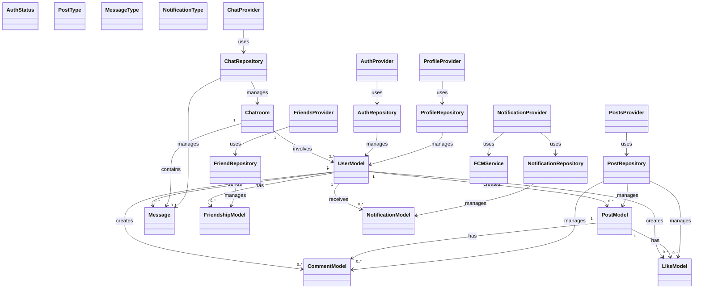

# Biểu Đồ Lớp (Class Diagram) Cho Ứng Dụng Social App - Mermaid

Tài liệu này chứa các biểu đồ lớp chi tiết cho các thành phần chính của ứng dụng Social App, được tổ chức theo các module chức năng và sử dụng cú pháp Mermaid.

## 1. Biểu Đồ Lớp - Module Xác Thực (Authentication)

## 2. Biểu Đồ Lớp - Module Bài Viết (Posts)

## 3. Biểu Đồ Lớp - Module Nhắn Tin (Chat)

## 4. Biểu Đồ Lớp - Module Bạn Bè (Friends)

## 5. Biểu Đồ Lớp - Module Thông Báo (Notifications)

## 6. Biểu Đồ Lớp - Module Hồ Sơ (Profile)

## 7. Biểu Đồ Lớp Tổng Quan - Mối Quan Hệ Giữa Các Module

## 8. Biểu Đồ Lớp - Cấu Trúc Dữ Liệu Firebase

