# Sơ Đồ Tuần Tự (Sequence Diagram) Cho Các Chức Năng Chính

Tài liệu này chứa các sơ đồ tuần tự cho các chức năng chính của ứng dụng Social App, được biểu diễn bằng cả PlantUML và Mermaid.

## 1. Chức Năng Đăng Ký

### PlantUML

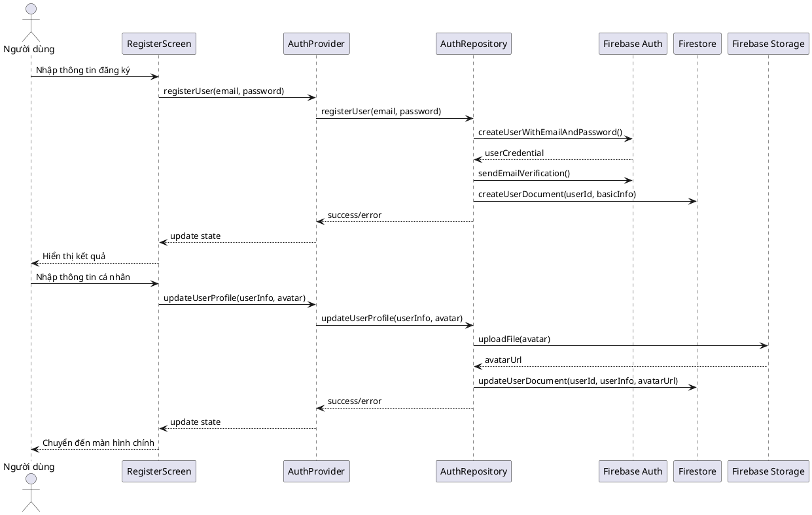
```plantuml
@startuml
actor "Người dùng" as User
participant "RegisterScreen" as UI
participant "AuthProvider" as Provider
participant "AuthRepository" as Repo
participant "Firebase Auth" as Auth
participant "Firestore" as DB
participant "Firebase Storage" as Storage

User -> UI: Nhập thông tin đăng ký
UI -> Provider: registerUser(email, password)
Provider -> Repo: registerUser(email, password)
Repo -> Auth: createUserWithEmailAndPassword()
Auth --> Repo: userCredential
Repo -> Auth: sendEmailVerification()
Repo -> DB: createUserDocument(userId, basicInfo)
Repo --> Provider: success/error
Provider --> UI: update state
UI --> User: Hiển thị kết quả

User -> UI: Nhập thông tin cá nhân
UI -> Provider: updateUserProfile(userInfo, avatar)
Provider -> Repo: updateUserProfile(userInfo, avatar)
Repo -> Storage: uploadFile(avatar)
Storage --> Repo: avatarUrl
Repo -> DB: updateUserDocument(userId, userInfo, avatarUrl)
Repo --> Provider: success/error
Provider --> UI: update state
UI --> User: Chuyển đến màn hình chính
@enduml
```

### Mermaid

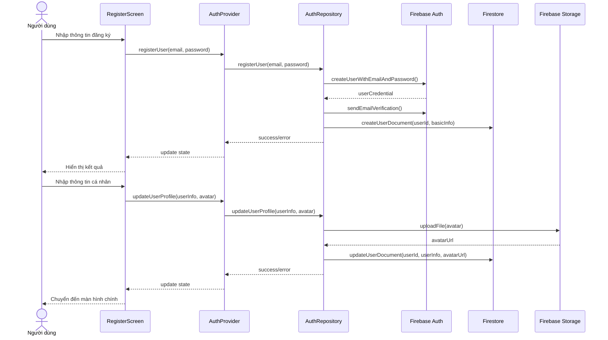
```mermaid
sequenceDiagram
    actor User as Người dùng
    participant UI as RegisterScreen
    participant Provider as AuthProvider
    participant Repo as AuthRepository
    participant Auth as Firebase Auth
    participant DB as Firestore
    participant Storage as Firebase Storage
    
    User->>UI: Nhập thông tin đăng ký
    UI->>Provider: registerUser(email, password)
    Provider->>Repo: registerUser(email, password)
    Repo->>Auth: createUserWithEmailAndPassword()
    Auth-->>Repo: userCredential
    Repo->>Auth: sendEmailVerification()
    Repo->>DB: createUserDocument(userId, basicInfo)
    Repo-->>Provider: success/error
    Provider-->>UI: update state
    UI-->>User: Hiển thị kết quả
    
    User->>UI: Nhập thông tin cá nhân
    UI->>Provider: updateUserProfile(userInfo, avatar)
    Provider->>Repo: updateUserProfile(userInfo, avatar)
    Repo->>Storage: uploadFile(avatar)
    Storage-->>Repo: avatarUrl
    Repo->>DB: updateUserDocument(userId, userInfo, avatarUrl)
    Repo-->>Provider: success/error
    Provider-->>UI: update state
    UI-->>User: Chuyển đến màn hình chính
```

## 2. Chức Năng Đăng Nhập

### PlantUML

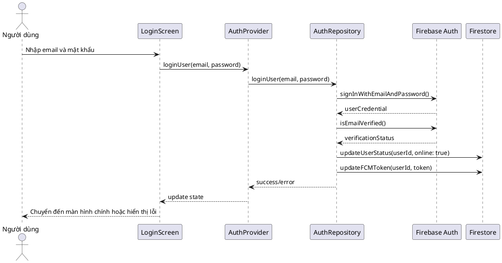
```plantuml
@startuml
actor "Người dùng" as User
participant "LoginScreen" as UI
participant "AuthProvider" as Provider
participant "AuthRepository" as Repo
participant "Firebase Auth" as Auth
participant "Firestore" as DB

User -> UI: Nhập email và mật khẩu
UI -> Provider: loginUser(email, password)
Provider -> Repo: loginUser(email, password)
Repo -> Auth: signInWithEmailAndPassword()
Auth --> Repo: userCredential
Repo -> Auth: isEmailVerified()
Auth --> Repo: verificationStatus
Repo -> DB: updateUserStatus(userId, online: true)
Repo -> DB: updateFCMToken(userId, token)
Repo --> Provider: success/error
Provider --> UI: update state
UI --> User: Chuyển đến màn hình chính hoặc hiển thị lỗi
@enduml
```

### Mermaid

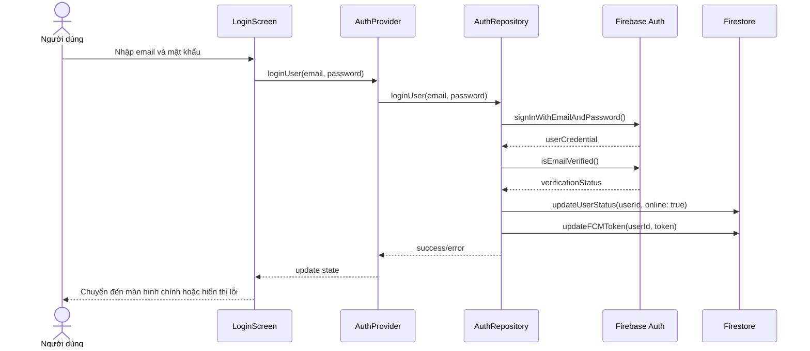
```mermaid
sequenceDiagram
    actor User as Người dùng
    participant UI as LoginScreen
    participant Provider as AuthProvider
    participant Repo as AuthRepository
    participant Auth as Firebase Auth
    participant DB as Firestore
    
    User->>UI: Nhập email và mật khẩu
    UI->>Provider: loginUser(email, password)
    Provider->>Repo: loginUser(email, password)
    Repo->>Auth: signInWithEmailAndPassword()
    Auth-->>Repo: userCredential
    Repo->>Auth: isEmailVerified()
    Auth-->>Repo: verificationStatus
    Repo->>DB: updateUserStatus(userId, online: true)
    Repo->>DB: updateFCMToken(userId, token)
    Repo-->>Provider: success/error
    Provider-->>UI: update state
    UI-->>User: Chuyển đến màn hình chính hoặc hiển thị lỗi
```

## 3. Chức Năng Nhắn Tin

### PlantUML

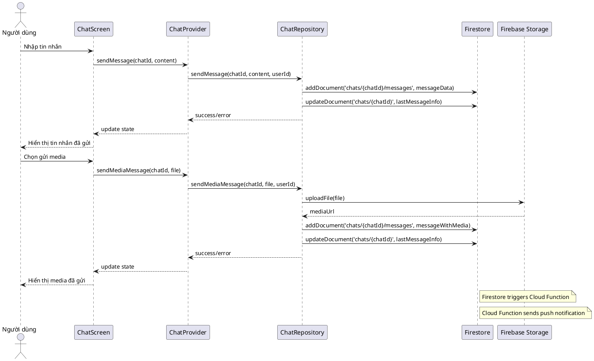
```plantuml
@startuml
actor "Người dùng" as User
participant "ChatScreen" as UI
participant "ChatProvider" as Provider
participant "ChatRepository" as Repo
participant "Firestore" as DB
participant "Firebase Storage" as Storage

User -> UI: Nhập tin nhắn
UI -> Provider: sendMessage(chatId, content)
Provider -> Repo: sendMessage(chatId, content, userId)
Repo -> DB: addDocument('chats/{chatId}/messages', messageData)
Repo -> DB: updateDocument('chats/{chatId}', lastMessageInfo)
Repo --> Provider: success/error
Provider --> UI: update state
UI --> User: Hiển thị tin nhắn đã gửi

User -> UI: Chọn gửi media
UI -> Provider: sendMediaMessage(chatId, file)
Provider -> Repo: sendMediaMessage(chatId, file, userId)
Repo -> Storage: uploadFile(file)
Storage --> Repo: mediaUrl
Repo -> DB: addDocument('chats/{chatId}/messages', messageWithMedia)
Repo -> DB: updateDocument('chats/{chatId}', lastMessageInfo)
Repo --> Provider: success/error
Provider --> UI: update state
UI --> User: Hiển thị media đã gửi

note right of DB: Firestore triggers Cloud Function
note right of DB: Cloud Function sends push notification
@enduml
```

### Mermaid

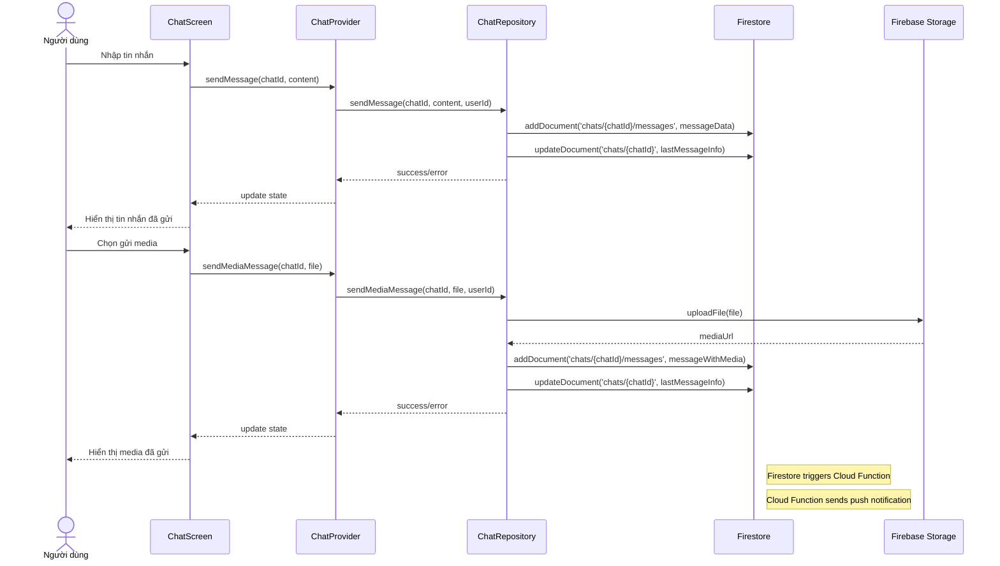
```mermaid
sequenceDiagram
    actor User as Người dùng
    participant UI as ChatScreen
    participant Provider as ChatProvider
    participant Repo as ChatRepository
    participant DB as Firestore
    participant Storage as Firebase Storage
    
    User->>UI: Nhập tin nhắn
    UI->>Provider: sendMessage(chatId, content)
    Provider->>Repo: sendMessage(chatId, content, userId)
    Repo->>DB: addDocument('chats/{chatId}/messages', messageData)
    Repo->>DB: updateDocument('chats/{chatId}', lastMessageInfo)
    Repo-->>Provider: success/error
    Provider-->>UI: update state
    UI-->>User: Hiển thị tin nhắn đã gửi
    
    User->>UI: Chọn gửi media
    UI->>Provider: sendMediaMessage(chatId, file)
    Provider->>Repo: sendMediaMessage(chatId, file, userId)
    Repo->>Storage: uploadFile(file)
    Storage-->>Repo: mediaUrl
    Repo->>DB: addDocument('chats/{chatId}/messages', messageWithMedia)
    Repo->>DB: updateDocument('chats/{chatId}', lastMessageInfo)
    Repo-->>Provider: success/error
    Provider-->>UI: update state
    UI-->>User: Hiển thị media đã gửi
    
    Note right of DB: Firestore triggers Cloud Function
    Note right of DB: Cloud Function sends push notification
```

## 4. Chức Năng Xem Thông Báo Bảng Tin

### PlantUML

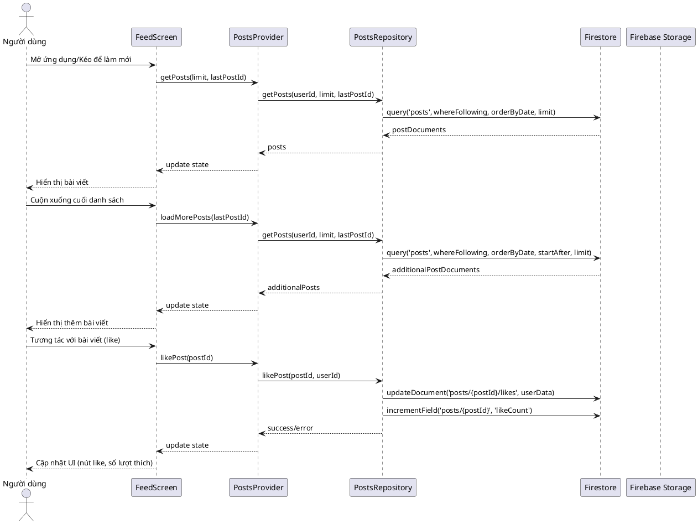
```plantuml
@startuml
actor "Người dùng" as User
participant "FeedScreen" as UI
participant "PostsProvider" as Provider
participant "PostsRepository" as Repo
participant "Firestore" as DB
participant "Firebase Storage" as Storage

User -> UI: Mở ứng dụng/Kéo để làm mới
UI -> Provider: getPosts(limit, lastPostId)
Provider -> Repo: getPosts(userId, limit, lastPostId)
Repo -> DB: query('posts', whereFollowing, orderByDate, limit)
DB --> Repo: postDocuments
Repo --> Provider: posts
Provider --> UI: update state
UI --> User: Hiển thị bài viết

User -> UI: Cuộn xuống cuối danh sách
UI -> Provider: loadMorePosts(lastPostId)
Provider -> Repo: getPosts(userId, limit, lastPostId)
Repo -> DB: query('posts', whereFollowing, orderByDate, startAfter, limit)
DB --> Repo: additionalPostDocuments
Repo --> Provider: additionalPosts
Provider --> UI: update state
UI --> User: Hiển thị thêm bài viết

User -> UI: Tương tác với bài viết (like)
UI -> Provider: likePost(postId)
Provider -> Repo: likePost(postId, userId)
Repo -> DB: updateDocument('posts/{postId}/likes', userData)
Repo -> DB: incrementField('posts/{postId}', 'likeCount')
Repo --> Provider: success/error
Provider --> UI: update state
UI --> User: Cập nhật UI (nút like, số lượt thích)
@enduml
```

### Mermaid

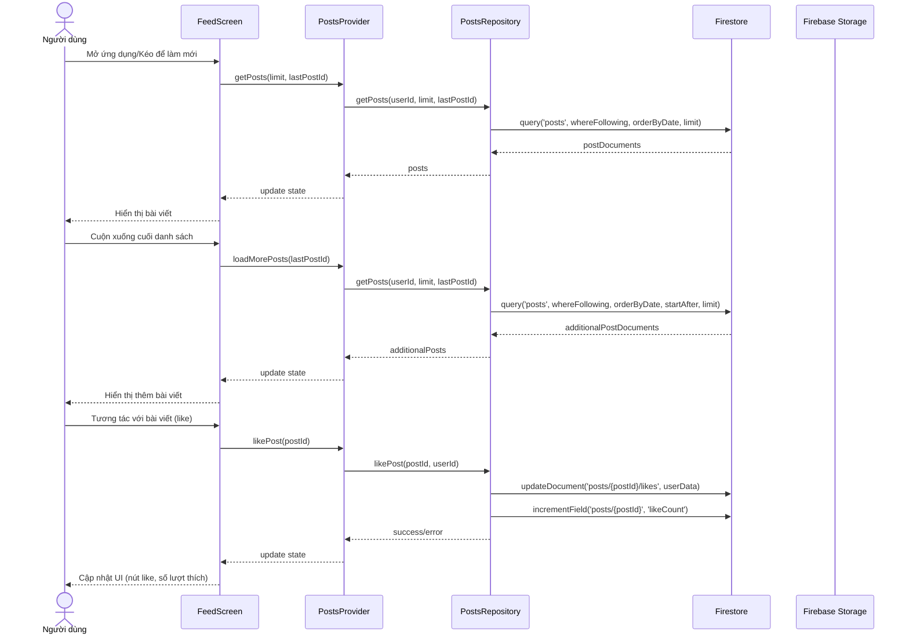
```mermaid
sequenceDiagram
    actor User as Người dùng
    participant UI as FeedScreen
    participant Provider as PostsProvider
    participant Repo as PostsRepository
    participant DB as Firestore
    participant Storage as Firebase Storage
    
    User->>UI: Mở ứng dụng/Kéo để làm mới
    UI->>Provider: getPosts(limit, lastPostId)
    Provider->>Repo: getPosts(userId, limit, lastPostId)
    Repo->>DB: query('posts', whereFollowing, orderByDate, limit)
    DB-->>Repo: postDocuments
    Repo-->>Provider: posts
    Provider-->>UI: update state
    UI-->>User: Hiển thị bài viết
    
    User->>UI: Cuộn xuống cuối danh sách
    UI->>Provider: loadMorePosts(lastPostId)
    Provider->>Repo: getPosts(userId, limit, lastPostId)
    Repo->>DB: query('posts', whereFollowing, orderByDate, startAfter, limit)
    DB-->>Repo: additionalPostDocuments
    Repo-->>Provider: additionalPosts
    Provider-->>UI: update state
    UI-->>User: Hiển thị thêm bài viết
    
    User->>UI: Tương tác với bài viết (like)
    UI->>Provider: likePost(postId)
    Provider->>Repo: likePost(postId, userId)
    Repo->>DB: updateDocument('posts/{postId}/likes', userData)
    Repo->>DB: incrementField('posts/{postId}', 'likeCount')
    Repo-->>Provider: success/error
    Provider-->>UI: update state
    UI-->>User: Cập nhật UI (nút like, số lượt thích)
```

## 5. Chức Năng Quản Lý Thông Tin Hồ Sơ Cá Nhân

### PlantUML

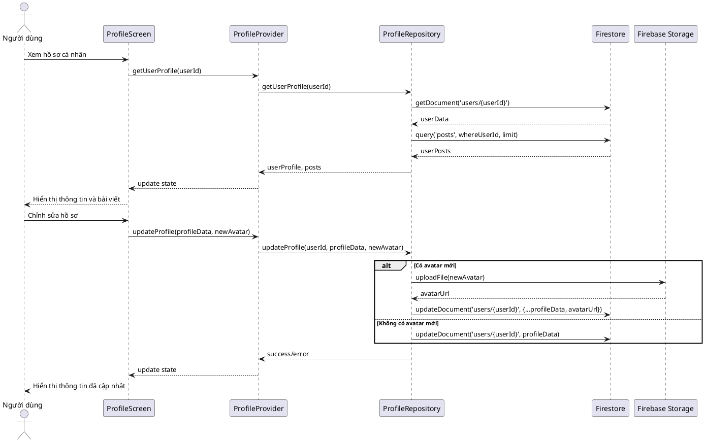
```plantuml
@startuml
actor "Người dùng" as User
participant "ProfileScreen" as UI
participant "ProfileProvider" as Provider
participant "ProfileRepository" as Repo
participant "Firestore" as DB
participant "Firebase Storage" as Storage

User -> UI: Xem hồ sơ cá nhân
UI -> Provider: getUserProfile(userId)
Provider -> Repo: getUserProfile(userId)
Repo -> DB: getDocument('users/{userId}')
DB --> Repo: userData
Repo -> DB: query('posts', whereUserId, limit)
DB --> Repo: userPosts
Repo --> Provider: userProfile, posts
Provider --> UI: update state
UI --> User: Hiển thị thông tin và bài viết

User -> UI: Chỉnh sửa hồ sơ
UI -> Provider: updateProfile(profileData, newAvatar)
Provider -> Repo: updateProfile(userId, profileData, newAvatar)
alt Có avatar mới
    Repo -> Storage: uploadFile(newAvatar)
    Storage --> Repo: avatarUrl
    Repo -> DB: updateDocument('users/{userId}', {...profileData, avatarUrl})
else Không có avatar mới
    Repo -> DB: updateDocument('users/{userId}', profileData)
end
Repo --> Provider: success/error
Provider --> UI: update state
UI --> User: Hiển thị thông tin đã cập nhật
@enduml
```

### Mermaid

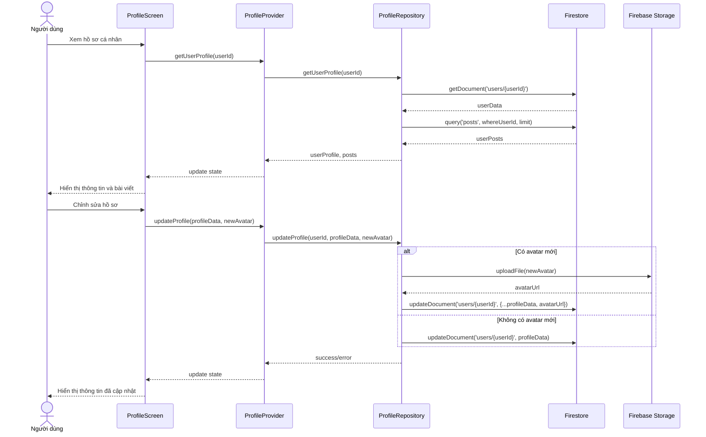
```mermaid
sequenceDiagram
    actor User as Người dùng
    participant UI as ProfileScreen
    participant Provider as ProfileProvider
    participant Repo as ProfileRepository
    participant DB as Firestore
    participant Storage as Firebase Storage
    
    User->>UI: Xem hồ sơ cá nhân
    UI->>Provider: getUserProfile(userId)
    Provider->>Repo: getUserProfile(userId)
    Repo->>DB: getDocument('users/{userId}')
    DB-->>Repo: userData
    Repo->>DB: query('posts', whereUserId, limit)
    DB-->>Repo: userPosts
    Repo-->>Provider: userProfile, posts
    Provider-->>UI: update state
    UI-->>User: Hiển thị thông tin và bài viết
    
    User->>UI: Chỉnh sửa hồ sơ
    UI->>Provider: updateProfile(profileData, newAvatar)
    Provider->>Repo: updateProfile(userId, profileData, newAvatar)
    
    alt Có avatar mới
        Repo->>Storage: uploadFile(newAvatar)
        Storage-->>Repo: avatarUrl
        Repo->>DB: updateDocument('users/{userId}', {...profileData, avatarUrl})
    else Không có avatar mới
        Repo->>DB: updateDocument('users/{userId}', profileData)
    end
    
    Repo-->>Provider: success/error
    Provider-->>UI: update state
    UI-->>User: Hiển thị thông tin đã cập nhật
```

## 6. Chức Năng Quản Lý Bài Viết

### PlantUML

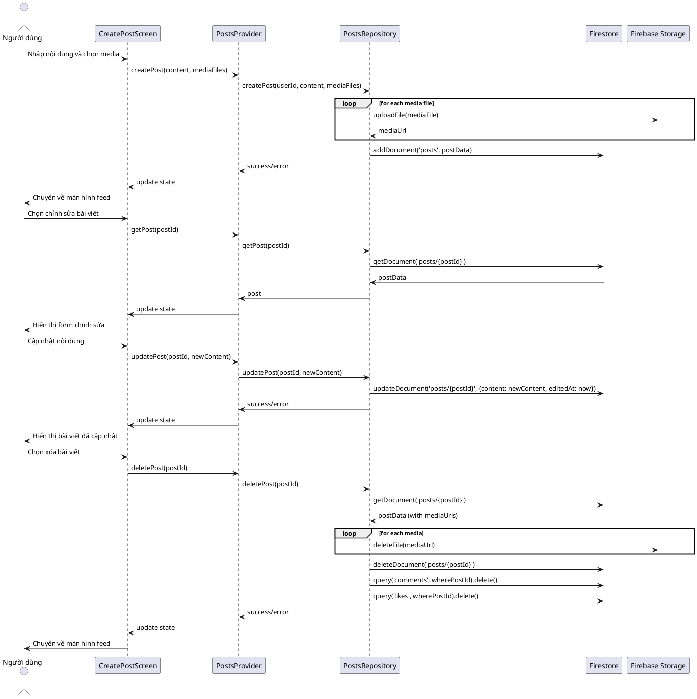
```plantuml
@startuml
actor "Người dùng" as User
participant "CreatePostScreen" as UI
participant "PostsProvider" as Provider
participant "PostsRepository" as Repo
participant "Firestore" as DB
participant "Firebase Storage" as Storage

User -> UI: Nhập nội dung và chọn media
UI -> Provider: createPost(content, mediaFiles)
Provider -> Repo: createPost(userId, content, mediaFiles)
loop for each media file
    Repo -> Storage: uploadFile(mediaFile)
    Storage --> Repo: mediaUrl
end
Repo -> DB: addDocument('posts', postData)
Repo --> Provider: success/error
Provider --> UI: update state
UI --> User: Chuyển về màn hình feed

User -> UI: Chọn chỉnh sửa bài viết
UI -> Provider: getPost(postId)
Provider -> Repo: getPost(postId)
Repo -> DB: getDocument('posts/{postId}')
DB --> Repo: postData
Repo --> Provider: post
Provider --> UI: update state
UI --> User: Hiển thị form chỉnh sửa

User -> UI: Cập nhật nội dung
UI -> Provider: updatePost(postId, newContent)
Provider -> Repo: updatePost(postId, newContent)
Repo -> DB: updateDocument('posts/{postId}', {content: newContent, editedAt: now})
Repo --> Provider: success/error
Provider --> UI: update state
UI --> User: Hiển thị bài viết đã cập nhật

User -> UI: Chọn xóa bài viết
UI -> Provider: deletePost(postId)
Provider -> Repo: deletePost(postId)
Repo -> DB: getDocument('posts/{postId}')
DB --> Repo: postData (with mediaUrls)
loop for each media
    Repo -> Storage: deleteFile(mediaUrl)
end
Repo -> DB: deleteDocument('posts/{postId}')
Repo -> DB: query('comments', wherePostId).delete()
Repo -> DB: query('likes', wherePostId).delete()
Repo --> Provider: success/error
Provider --> UI: update state
UI --> User: Chuyển về màn hình feed
@enduml
```

### Mermaid

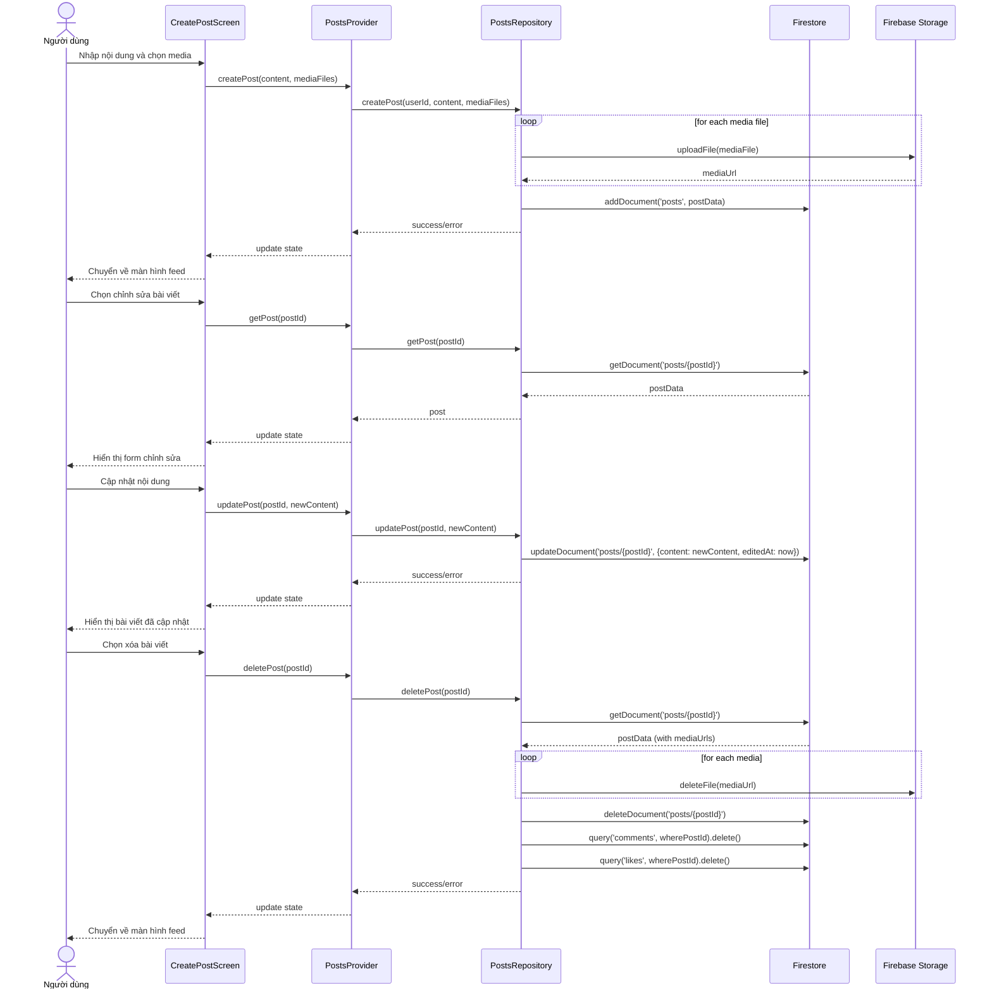
```mermaid
sequenceDiagram
    actor User as Người dùng
    participant UI as CreatePostScreen
    participant Provider as PostsProvider
    participant Repo as PostsRepository
    participant DB as Firestore
    participant Storage as Firebase Storage
    
    User->>UI: Nhập nội dung và chọn media
    UI->>Provider: createPost(content, mediaFiles)
    Provider->>Repo: createPost(userId, content, mediaFiles)
    
    loop for each media file
        Repo->>Storage: uploadFile(mediaFile)
        Storage-->>Repo: mediaUrl
    end
    
    Repo->>DB: addDocument('posts', postData)
    Repo-->>Provider: success/error
    Provider-->>UI: update state
    UI-->>User: Chuyển về màn hình feed
    
    User->>UI: Chọn chỉnh sửa bài viết
    UI->>Provider: getPost(postId)
    Provider->>Repo: getPost(postId)
    Repo->>DB: getDocument('posts/{postId}')
    DB-->>Repo: postData
    Repo-->>Provider: post
    Provider-->>UI: update state
    UI-->>User: Hiển thị form chỉnh sửa
    
    User->>UI: Cập nhật nội dung
    UI->>Provider: updatePost(postId, newContent)
    Provider->>Repo: updatePost(postId, newContent)
    Repo->>DB: updateDocument('posts/{postId}', {content: newContent, editedAt: now})
    Repo-->>Provider: success/error
    Provider-->>UI: update state
    UI-->>User: Hiển thị bài viết đã cập nhật
    
    User->>UI: Chọn xóa bài viết
    UI->>Provider: deletePost(postId)
    Provider->>Repo: deletePost(postId)
    Repo->>DB: getDocument('posts/{postId}')
    DB-->>Repo: postData (with mediaUrls)
    
    loop for each media
        Repo->>Storage: deleteFile(mediaUrl)
    end
    
    Repo->>DB: deleteDocument('posts/{postId}')
    Repo->>DB: query('comments', wherePostId).delete()
    Repo->>DB: query('likes', wherePostId).delete()
    Repo-->>Provider: success/error
    Provider-->>UI: update state
    UI-->>User: Chuyển về màn hình feed
```

## 7. Chức Năng Quản Lý Bạn Bè

### PlantUML

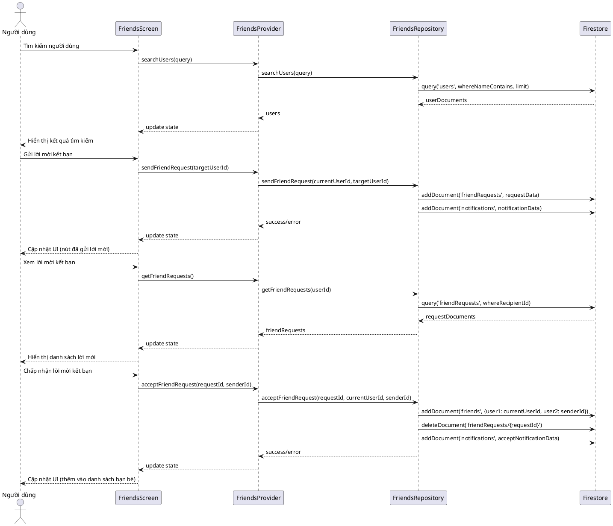
```plantuml
@startuml
actor "Người dùng" as User
participant "FriendsScreen" as UI
participant "FriendsProvider" as Provider
participant "FriendsRepository" as Repo
participant "Firestore" as DB

User -> UI: Tìm kiếm người dùng
UI -> Provider: searchUsers(query)
Provider -> Repo: searchUsers(query)
Repo -> DB: query('users', whereNameContains, limit)
DB --> Repo: userDocuments
Repo --> Provider: users
Provider --> UI: update state
UI --> User: Hiển thị kết quả tìm kiếm

User -> UI: Gửi lời mời kết bạn
UI -> Provider: sendFriendRequest(targetUserId)
Provider -> Repo: sendFriendRequest(currentUserId, targetUserId)
Repo -> DB: addDocument('friendRequests', requestData)
Repo -> DB: addDocument('notifications', notificationData)
Repo --> Provider: success/error
Provider --> UI: update state
UI --> User: Cập nhật UI (nút đã gửi lời mời)

User -> UI: Xem lời mời kết bạn
UI -> Provider: getFriendRequests()
Provider -> Repo: getFriendRequests(userId)
Repo -> DB: query('friendRequests', whereRecipientId)
DB --> Repo: requestDocuments
Repo --> Provider: friendRequests
Provider --> UI: update state
UI --> User: Hiển thị danh sách lời mời

User -> UI: Chấp nhận lời mời kết bạn
UI -> Provider: acceptFriendRequest(requestId, senderId)
Provider -> Repo: acceptFriendRequest(requestId, currentUserId, senderId)
Repo -> DB: addDocument('friends', {user1: currentUserId, user2: senderId})
Repo -> DB: deleteDocument('friendRequests/{requestId}')
Repo -> DB: addDocument('notifications', acceptNotificationData)
Repo --> Provider: success/error
Provider --> UI: update state
UI --> User: Cập nhật UI (thêm vào danh sách bạn bè)
@enduml
```

### Mermaid

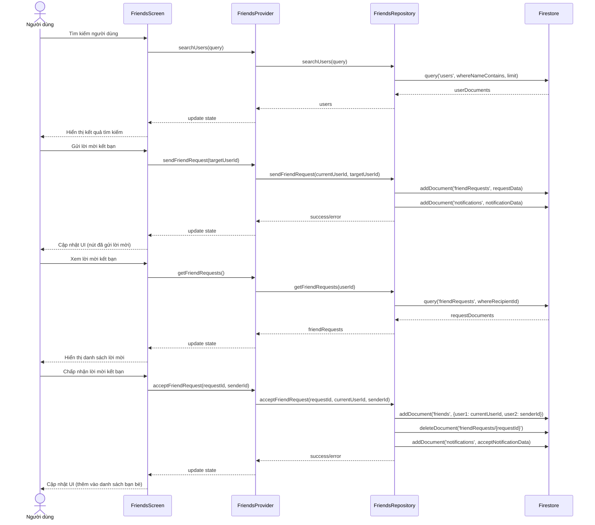
```mermaid
sequenceDiagram
    actor User as Người dùng
    participant UI as FriendsScreen
    participant Provider as FriendsProvider
    participant Repo as FriendsRepository
    participant DB as Firestore
    
    User->>UI: Tìm kiếm người dùng
    UI->>Provider: searchUsers(query)
    Provider->>Repo: searchUsers(query)
    Repo->>DB: query('users', whereNameContains, limit)
    DB-->>Repo: userDocuments
    Repo-->>Provider: users
    Provider-->>UI: update state
    UI-->>User: Hiển thị kết quả tìm kiếm
    
    User->>UI: Gửi lời mời kết bạn
    UI->>Provider: sendFriendRequest(targetUserId)
    Provider->>Repo: sendFriendRequest(currentUserId, targetUserId)
    Repo->>DB: addDocument('friendRequests', requestData)
    Repo->>DB: addDocument('notifications', notificationData)
    Repo-->>Provider: success/error
    Provider-->>UI: update state
    UI-->>User: Cập nhật UI (nút đã gửi lời mời)
    
    User->>UI: Xem lời mời kết bạn
    UI->>Provider: getFriendRequests()
    Provider->>Repo: getFriendRequests(userId)
    Repo->>DB: query('friendRequests', whereRecipientId)
    DB-->>Repo: requestDocuments
    Repo-->>Provider: friendRequests
    Provider-->>UI: update state
    UI-->>User: Hiển thị danh sách lời mời
    
    User->>UI: Chấp nhận lời mời kết bạn
    UI->>Provider: acceptFriendRequest(requestId, senderId)
    Provider->>Repo: acceptFriendRequest(requestId, currentUserId, senderId)
    Repo->>DB: addDocument('friends', {user1: currentUserId, user2: senderId})
    Repo->>DB: deleteDocument('friendRequests/{requestId}')
    Repo->>DB: addDocument('notifications', acceptNotificationData)
    Repo-->>Provider: success/error
    Provider-->>UI: update state
    UI-->>User: Cập nhật UI (thêm vào danh sách bạn bè)
```

## 8. Chức Năng Quản Lý Nhóm Chat

### PlantUML

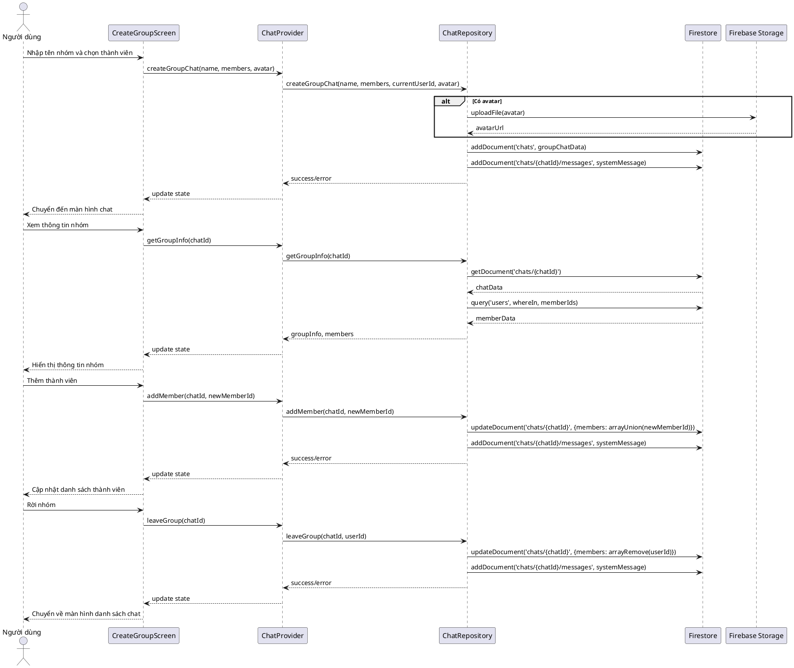
```plantuml
@startuml
actor "Người dùng" as User
participant "CreateGroupScreen" as UI
participant "ChatProvider" as Provider
participant "ChatRepository" as Repo
participant "Firestore" as DB
participant "Firebase Storage" as Storage

User -> UI: Nhập tên nhóm và chọn thành viên
UI -> Provider: createGroupChat(name, members, avatar)
Provider -> Repo: createGroupChat(name, members, currentUserId, avatar)
alt Có avatar
    Repo -> Storage: uploadFile(avatar)
    Storage --> Repo: avatarUrl
end
Repo -> DB: addDocument('chats', groupChatData)
Repo -> DB: addDocument('chats/{chatId}/messages', systemMessage)
Repo --> Provider: success/error
Provider --> UI: update state
UI --> User: Chuyển đến màn hình chat

User -> UI: Xem thông tin nhóm
UI -> Provider: getGroupInfo(chatId)
Provider -> Repo: getGroupInfo(chatId)
Repo -> DB: getDocument('chats/{chatId}')
DB --> Repo: chatData
Repo -> DB: query('users', whereIn, memberIds)
DB --> Repo: memberData
Repo --> Provider: groupInfo, members
Provider --> UI: update state
UI --> User: Hiển thị thông tin nhóm

User -> UI: Thêm thành viên
UI -> Provider: addMember(chatId, newMemberId)
Provider -> Repo: addMember(chatId, newMemberId)
Repo -> DB: updateDocument('chats/{chatId}', {members: arrayUnion(newMemberId)})
Repo -> DB: addDocument('chats/{chatId}/messages', systemMessage)
Repo --> Provider: success/error
Provider --> UI: update state
UI --> User: Cập nhật danh sách thành viên

User -> UI: Rời nhóm
UI -> Provider: leaveGroup(chatId)
Provider -> Repo: leaveGroup(chatId, userId)
Repo -> DB: updateDocument('chats/{chatId}', {members: arrayRemove(userId)})
Repo -> DB: addDocument('chats/{chatId}/messages', systemMessage)
Repo --> Provider: success/error
Provider --> UI: update state
UI --> User: Chuyển về màn hình danh sách chat
@enduml
```

### Mermaid

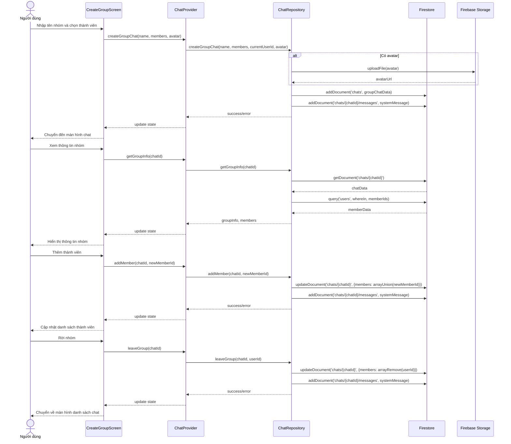
```mermaid
sequenceDiagram
    actor User as Người dùng
    participant UI as CreateGroupScreen
    participant Provider as ChatProvider
    participant Repo as ChatRepository
    participant DB as Firestore
    participant Storage as Firebase Storage
    
    User->>UI: Nhập tên nhóm và chọn thành viên
    UI->>Provider: createGroupChat(name, members, avatar)
    Provider->>Repo: createGroupChat(name, members, currentUserId, avatar)
    
    alt Có avatar
        Repo->>Storage: uploadFile(avatar)
        Storage-->>Repo: avatarUrl
    end
    
    Repo->>DB: addDocument('chats', groupChatData)
    Repo->>DB: addDocument('chats/{chatId}/messages', systemMessage)
    Repo-->>Provider: success/error
    Provider-->>UI: update state
    UI-->>User: Chuyển đến màn hình chat
    
    User->>UI: Xem thông tin nhóm
    UI->>Provider: getGroupInfo(chatId)
    Provider->>Repo: getGroupInfo(chatId)
    Repo->>DB: getDocument('chats/{chatId}')
    DB-->>Repo: chatData
    Repo->>DB: query('users', whereIn, memberIds)
    DB-->>Repo: memberData
    Repo-->>Provider: groupInfo, members
    Provider-->>UI: update state
    UI-->>User: Hiển thị thông tin nhóm
    
    User->>UI: Thêm thành viên
    UI->>Provider: addMember(chatId, newMemberId)
    Provider->>Repo: addMember(chatId, newMemberId)
    Repo->>DB: updateDocument('chats/{chatId}', {members: arrayUnion(newMemberId)})
    Repo->>DB: addDocument('chats/{chatId}/messages', systemMessage)
    Repo-->>Provider: success/error
    Provider-->>UI: update state
    UI-->>User: Cập nhật danh sách thành viên
    
    User->>UI: Rời nhóm
    UI->>Provider: leaveGroup(chatId)
    Provider->>Repo: leaveGroup(chatId, userId)
    Repo->>DB: updateDocument('chats/{chatId}', {members: arrayRemove(userId)})
    Repo->>DB: addDocument('chats/{chatId}/messages', systemMessage)
    Repo-->>Provider: success/error
    Provider-->>UI: update state
    UI-->>User: Chuyển về màn hình danh sách chat
``` 