# Biểu Đồ Tuần Tự Chi Tiết (Sequence Diagram) Cho Các Chức Năng

Tài liệu này chứa các biểu đồ tuần tự chi tiết cho 14 chức năng chính của ứng dụng Social App, sử dụng 3 lane cơ bản.

## 1. Biểu Đồ Tuần Tự – Chức Năng Đăng Ký

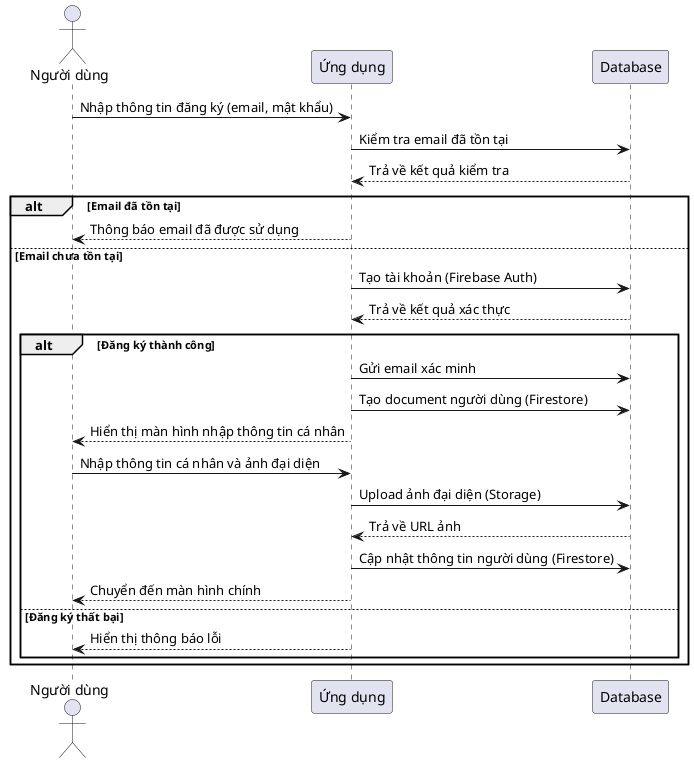

## 2. Biểu Đồ Tuần Tự – Chức Năng Đăng Nhập

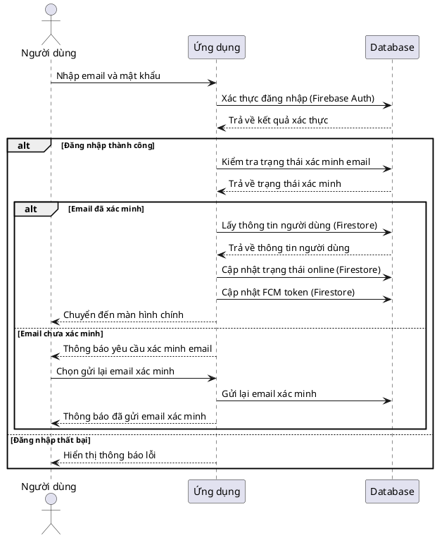

## 3. Biểu Đồ Tuần Tự – Chức Năng Nhắn Tin

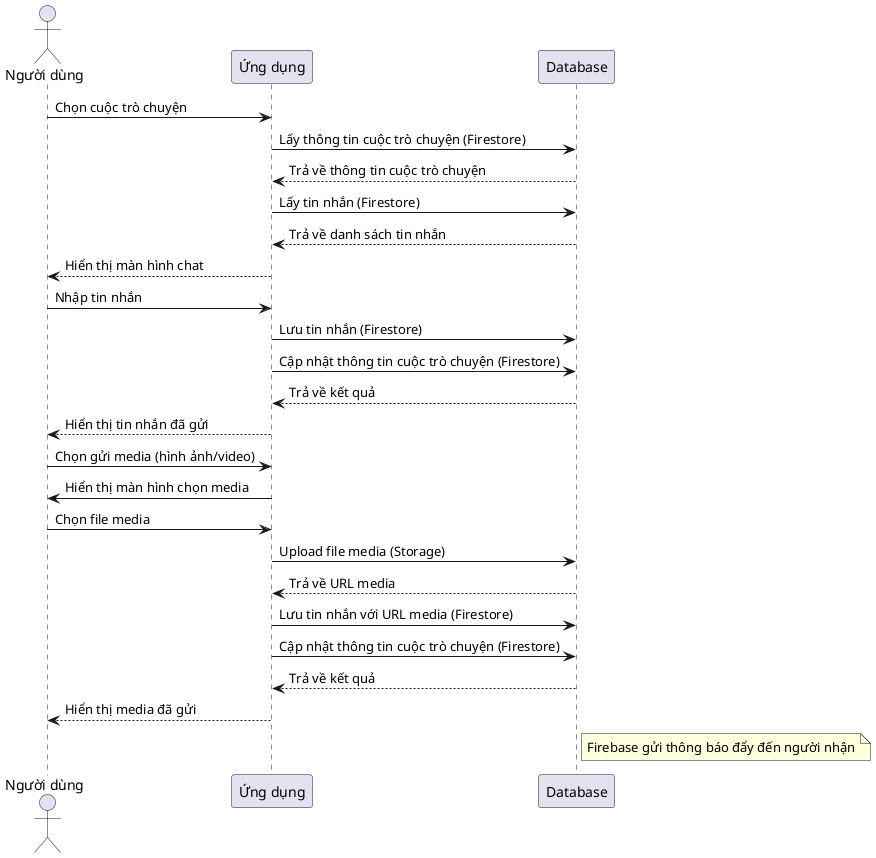

## 4. Biểu Đồ Tuần Tự – Chức Năng Xem Thông Báo

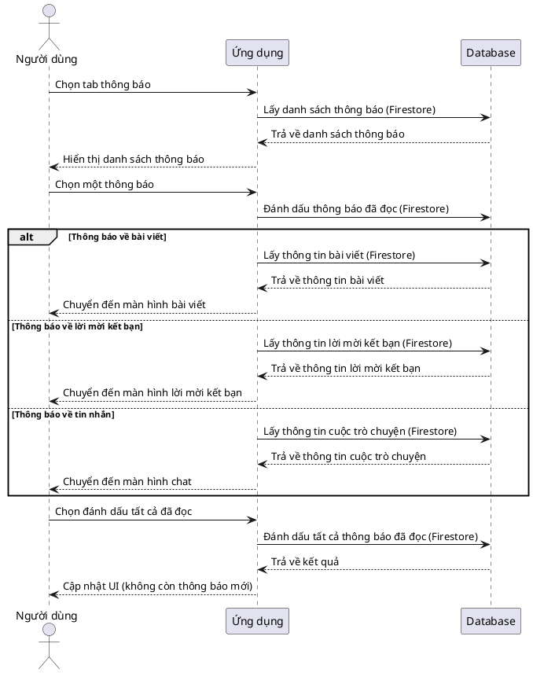

## 5. Biểu Đồ Tuần Tự – Chức Năng Quản Lý Thông Tin Cá Nhân

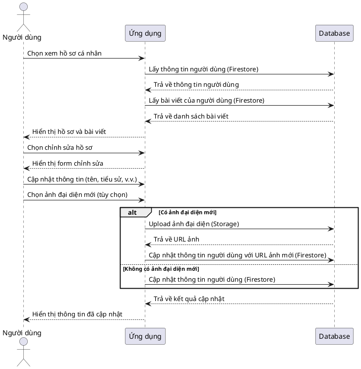

## 6. Biểu Đồ Tuần Tự – Chức Năng Thêm Bài Viết

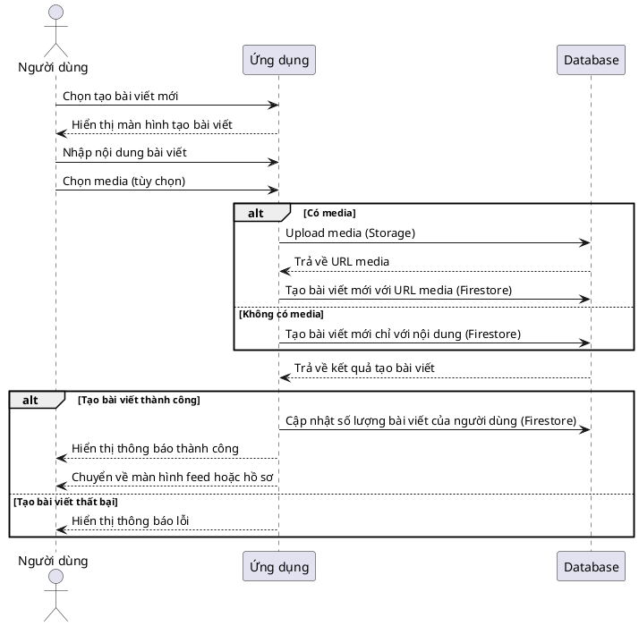

## 7. Biểu Đồ Tuần Tự – Chức Năng Chỉnh Sửa Bài Viết

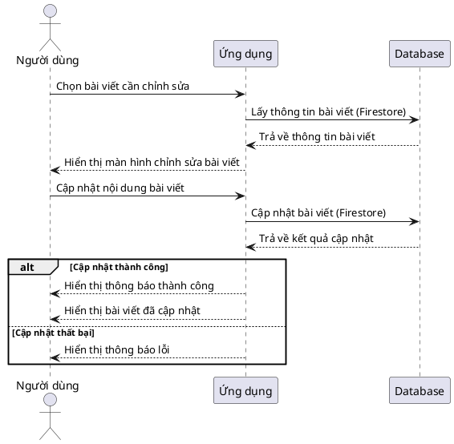

## 8. Biểu Đồ Tuần Tự – Chức Năng Xóa Bài Viết

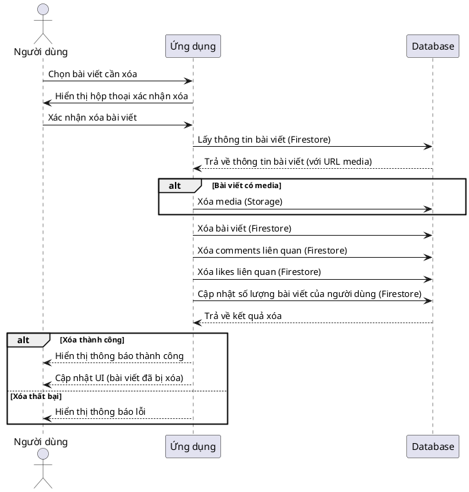

## 9. Biểu Đồ Tuần Tự – Chức Năng Kết Bạn

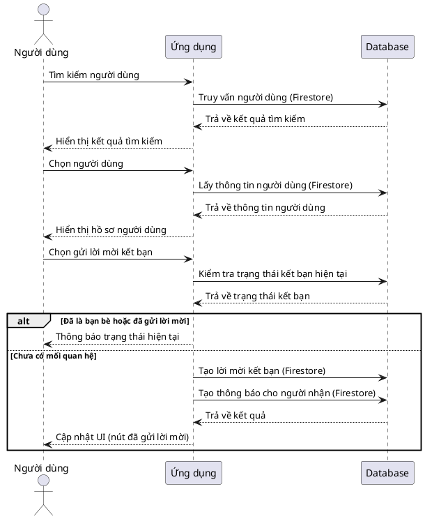

## 10. Biểu Đồ Tuần Tự – Chức Năng Đồng Ý Kết Bạn

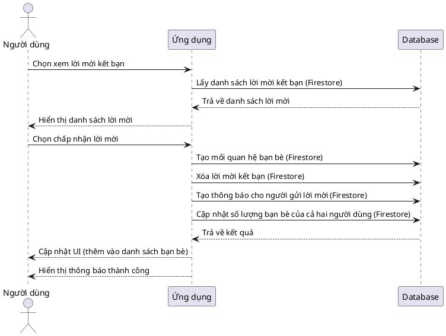

## 11. Biểu Đồ Tuần Tự – Chức Năng Xóa Bạn Bè

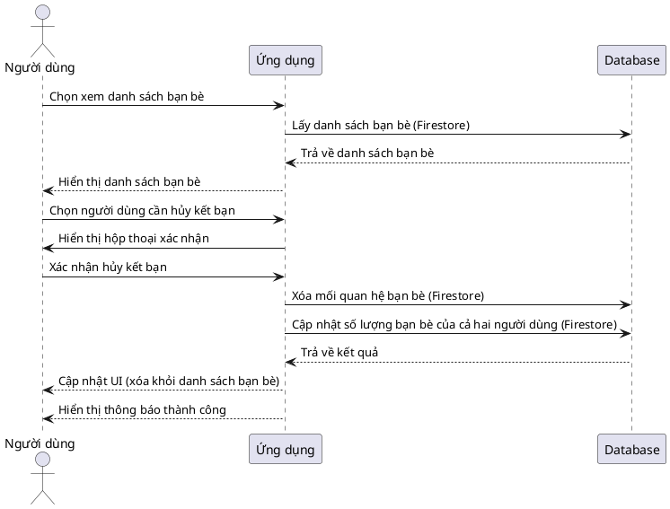

## 12. Biểu Đồ Tuần Tự – Chức Năng Tạo Nhóm Chat

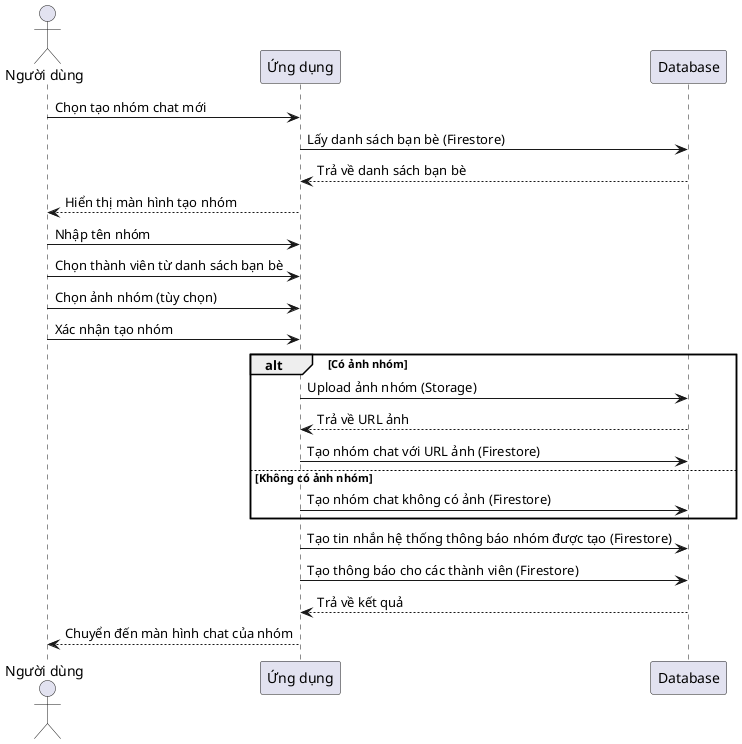

## 13. Biểu Đồ Tuần Tự – Chức Năng Sửa Nhóm Chat

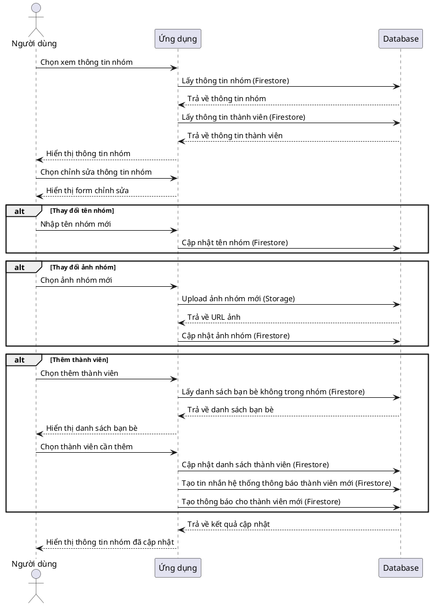

## 14. Biểu Đồ Tuần Tự – Chức Năng Xóa Nhóm Chat

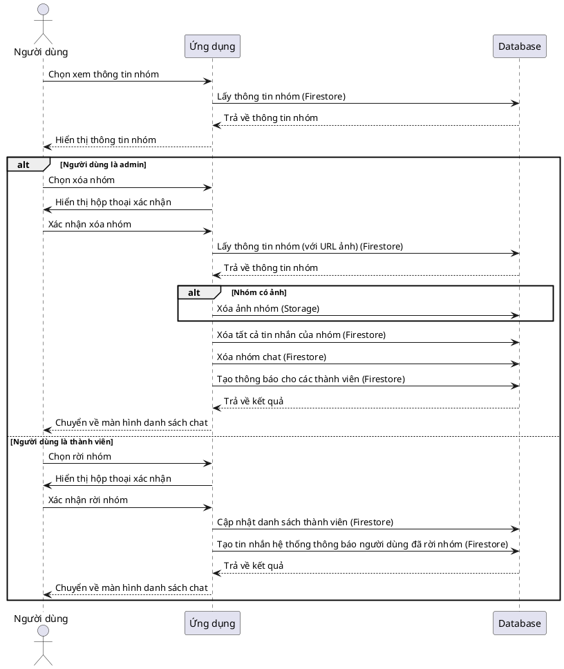