# Biểu Đồ Use Case Đã Sửa Cho Các Chức Năng

Tài liệu này chứa các biểu đồ use case đã sửa cho 14 chức năng chính của ứng dụng Social App, với các actor chính xác hơn dựa trên cấu trúc thực tế của ứng dụng.

## 1. Biểu Đồ Use Case – Chức Năng Đăng Ký

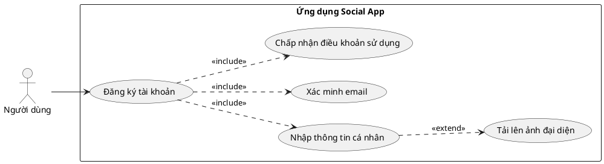

## 2. Biểu Đồ Use Case – Chức Năng Đăng Nhập

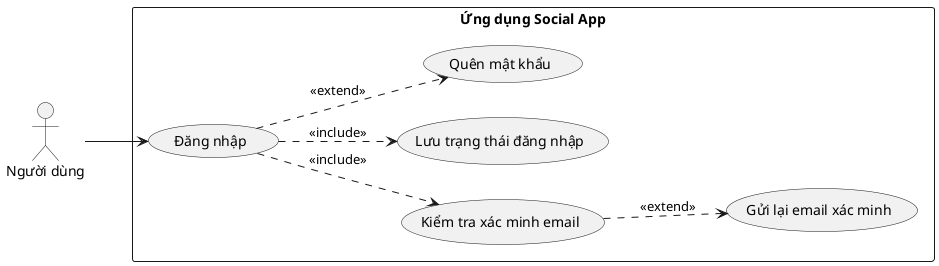

## 3. Biểu Đồ Use Case – Chức Năng Nhắn Tin

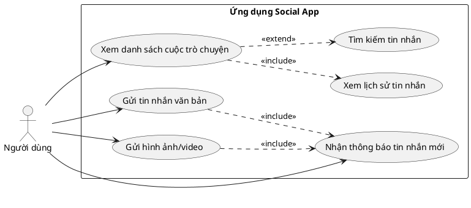

## 4. Biểu Đồ Use Case – Chức Năng Xem Thông Báo

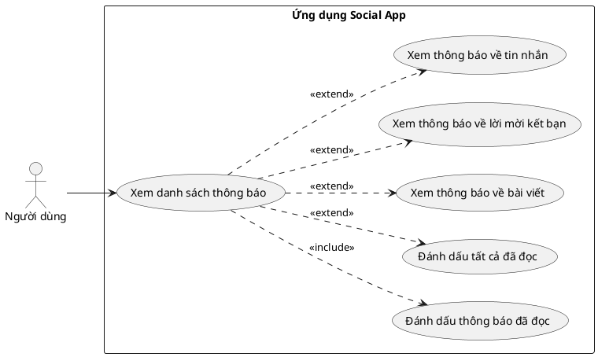

## 5. Biểu Đồ Use Case – Chức Năng Quản Lý Thông Tin Cá Nhân

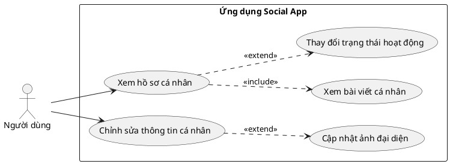

## 6. Biểu Đồ Use Case – Chức Năng Thêm Bài Viết

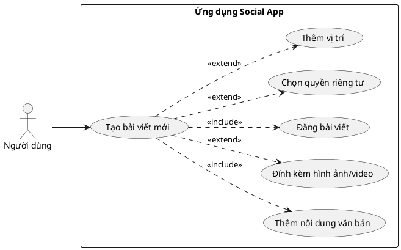

## 7. Biểu Đồ Use Case – Chức Năng Chỉnh Sửa Bài Viết

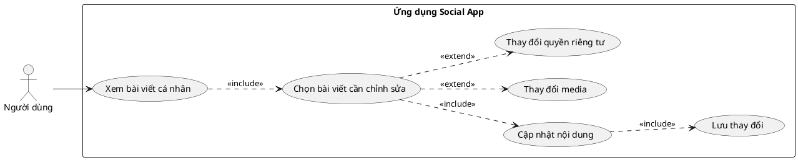

## 8. Biểu Đồ Use Case – Chức Năng Xóa Bài Viết

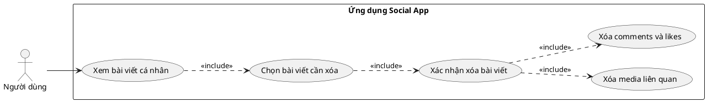

## 9. Biểu Đồ Use Case – Chức Năng Kết Bạn

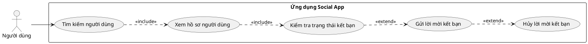

## 10. Biểu Đồ Use Case – Chức Năng Đồng Ý Kết Bạn

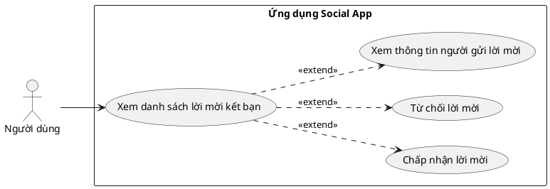

## 11. Biểu Đồ Use Case – Chức Năng Xóa Bạn Bè

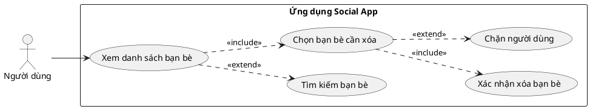

## 12. Biểu Đồ Use Case – Chức Năng Tạo Nhóm Chat

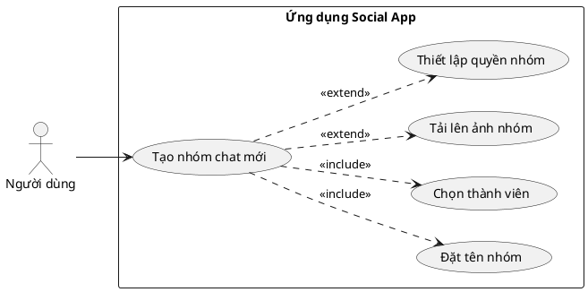

## 13. Biểu Đồ Use Case – Chức Năng Sửa Nhóm Chat

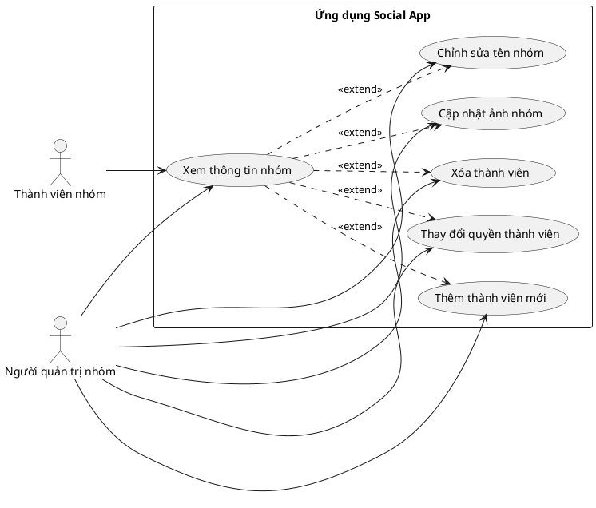

## 14. Biểu Đồ Use Case – Chức Năng Xóa Nhóm Chat

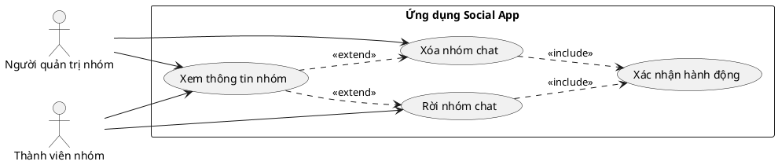