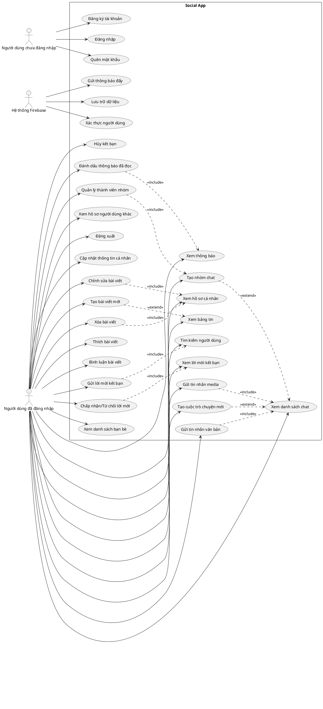
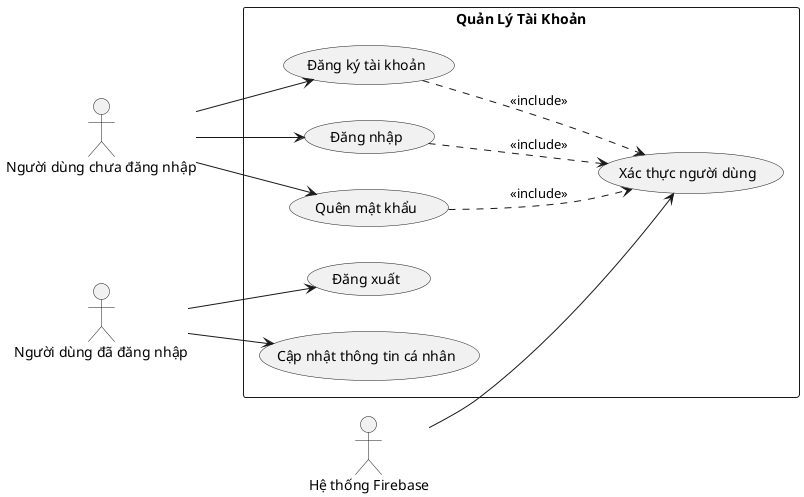
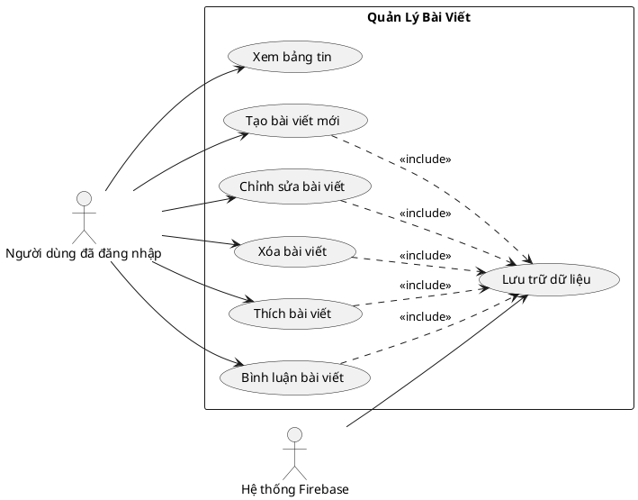
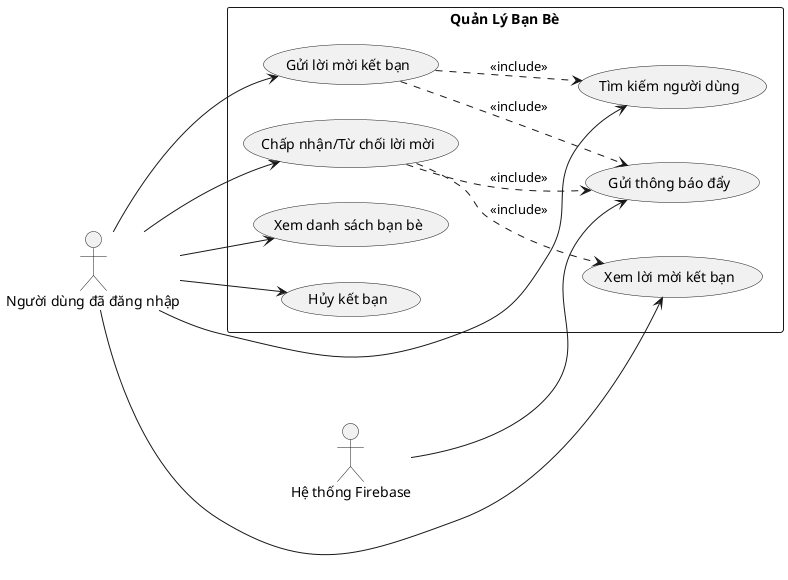
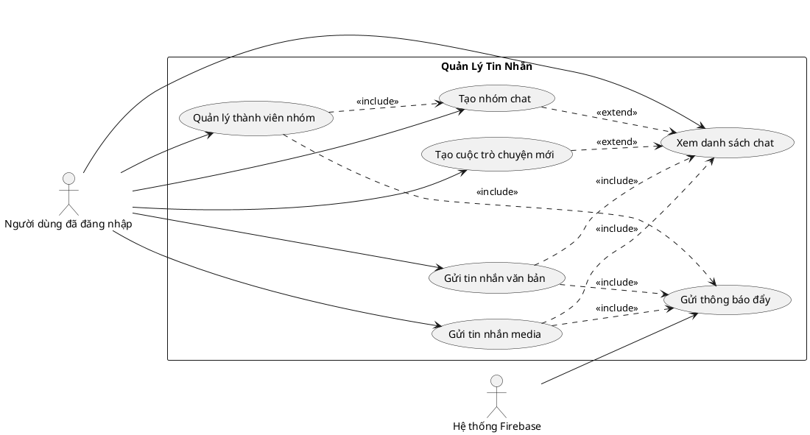

# Biểu Đồ Usecase (Use Case Diagram) Cho Ứng Dụng Social App

Tài liệu này chứa biểu đồ usecase cho ứng dụng Social App, được biểu diễn bằng cả PlantUML và Mermaid.

## Biểu Đồ Usecase Tổng Quan

### PlantUML

### Mermaid

```mermaid
graph TB
    %% Actors
    Guest[Người dùng chưa đăng nhập]
    User[Người dùng đã đăng nhập]
    Firebase[Hệ thống Firebase]
    
    %% Use Cases - Quản lý tài khoản
    UC1[Đăng ký tài khoản]
    UC2[Đăng nhập]
    UC3[Đăng xuất]
    UC4[Quên mật khẩu]
    UC5[Cập nhật thông tin cá nhân]
    
    %% Use Cases - Quản lý bài viết
    UC6[Xem bảng tin]
    UC7[Tạo bài viết mới]
    UC8[Chỉnh sửa bài viết]
    UC9[Xóa bài viết]
    UC10[Thích bài viết]
    UC11[Bình luận bài viết]
    
    %% Use Cases - Quản lý bạn bè
    UC12[Tìm kiếm người dùng]
    UC13[Gửi lời mời kết bạn]
    UC14[Xem lời mời kết bạn]
    UC15[Chấp nhận/Từ chối lời mời]
    UC16[Xem danh sách bạn bè]
    UC17[Hủy kết bạn]
    
    %% Use Cases - Quản lý tin nhắn
    UC18[Xem danh sách chat]
    UC19[Tạo cuộc trò chuyện mới]
    UC20[Gửi tin nhắn văn bản]
    UC21[Gửi tin nhắn media]
    UC22[Tạo nhóm chat]
    UC23[Quản lý thành viên nhóm]
    
    %% Use Cases - Quản lý thông báo
    UC24[Xem thông báo]
    UC25[Đánh dấu thông báo đã đọc]
    
    %% Use Cases - Quản lý hồ sơ
    UC26[Xem hồ sơ cá nhân]
    UC27[Xem hồ sơ người dùng khác]
    
    %% Use Cases - Hệ thống
    UC28[Gửi thông báo đẩy]
    UC29[Lưu trữ dữ liệu]
    UC30[Xác thực người dùng]
    
    %% Relationships - Guest
    Guest --> UC1
    Guest --> UC2
    Guest --> UC4
    
    %% Relationships - User
    User --> UC3
    User --> UC5
    User --> UC6
    User --> UC7
    User --> UC8
    User --> UC9
    User --> UC10
    User --> UC11
    User --> UC12
    User --> UC13
    User --> UC14
    User --> UC15
    User --> UC16
    User --> UC17
    User --> UC18
    User --> UC19
    User --> UC20
    User --> UC21
    User --> UC22
    User --> UC23
    User --> UC24
    User --> UC25
    User --> UC26
    User --> UC27
    
    %% Relationships - Firebase
    Firebase --> UC28
    Firebase --> UC29
    Firebase --> UC30
    
    %% Include/Extend Relationships
    UC7 -.-> UC6
    UC8 -.-> UC26
    UC9 -.-> UC26
    UC13 -.-> UC12
    UC15 -.-> UC14
    UC19 -.-> UC18
    UC20 -.-> UC18
    UC21 -.-> UC18
    UC22 -.-> UC18
    UC23 -.-> UC22
    UC25 -.-> UC24
```

## Biểu Đồ Usecase Theo Nhóm Chức Năng

### 1. Quản Lý Tài Khoản

### 2. Quản Lý Bài Viết

### 3. Quản Lý Bạn Bè

### 4. Quản Lý Tin Nhắn

## Mô Tả Chi Tiết Các Usecase

### Quản Lý Tài Khoản

1. **Đăng ký tài khoản**
   - Actor: Người dùng chưa đăng nhập
   - Mô tả: Người dùng tạo tài khoản mới bằng email và mật khẩu, sau đó cung cấp thông tin cá nhân và ảnh đại diện
   - Luồng chính: Nhập thông tin đăng ký > Xác thực email > Cập nhật thông tin cá nhân

2. **Đăng nhập**
   - Actor: Người dùng chưa đăng nhập
   - Mô tả: Người dùng đăng nhập vào ứng dụng bằng email và mật khẩu
   - Luồng chính: Nhập thông tin đăng nhập > Xác thực > Chuyển đến màn hình chính

3. **Đăng xuất**
   - Actor: Người dùng đã đăng nhập
   - Mô tả: Người dùng đăng xuất khỏi ứng dụng
   - Luồng chính: Chọn đăng xuất > Xác nhận > Chuyển đến màn hình đăng nhập

4. **Quên mật khẩu**
   - Actor: Người dùng chưa đăng nhập
   - Mô tả: Người dùng yêu cầu đặt lại mật khẩu khi quên
   - Luồng chính: Nhập email > Nhận email đặt lại mật khẩu > Đặt mật khẩu mới

5. **Cập nhật thông tin cá nhân**
   - Actor: Người dùng đã đăng nhập
   - Mô tả: Người dùng cập nhật thông tin cá nhân và ảnh đại diện
   - Luồng chính: Chọn chỉnh sửa hồ sơ > Cập nhật thông tin > Lưu thay đổi

### Quản Lý Bài Viết

6. **Xem bảng tin**
   - Actor: Người dùng đã đăng nhập
   - Mô tả: Người dùng xem bài viết từ bạn bè và người đang theo dõi
   - Luồng chính: Mở ứng dụng > Xem bảng tin > Cuộn để tải thêm bài viết

7. **Tạo bài viết mới**
   - Actor: Người dùng đã đăng nhập
   - Mô tả: Người dùng tạo bài viết mới với nội dung và media (tùy chọn)
   - Luồng chính: Chọn tạo bài viết > Nhập nội dung > Thêm media (tùy chọn) > Đăng bài

8. **Chỉnh sửa bài viết**
   - Actor: Người dùng đã đăng nhập
   - Mô tả: Người dùng chỉnh sửa nội dung bài viết đã đăng
   - Luồng chính: Chọn bài viết > Chọn chỉnh sửa > Cập nhật nội dung > Lưu thay đổi

9. **Xóa bài viết**
   - Actor: Người dùng đã đăng nhập
   - Mô tả: Người dùng xóa bài viết đã đăng
   - Luồng chính: Chọn bài viết > Chọn xóa > Xác nhận xóa

10. **Thích bài viết**
    - Actor: Người dùng đã đăng nhập
    - Mô tả: Người dùng thích hoặc bỏ thích bài viết
    - Luồng chính: Chọn bài viết > Nhấn nút thích/bỏ thích

11. **Bình luận bài viết**
    - Actor: Người dùng đã đăng nhập
    - Mô tả: Người dùng thêm bình luận vào bài viết
    - Luồng chính: Chọn bài viết > Nhập bình luận > Gửi bình luận

### Quản Lý Bạn Bè

12. **Tìm kiếm người dùng**
    - Actor: Người dùng đã đăng nhập
    - Mô tả: Người dùng tìm kiếm người dùng khác theo tên hoặc email
    - Luồng chính: Nhập từ khóa tìm kiếm > Xem kết quả tìm kiếm

13. **Gửi lời mời kết bạn**
    - Actor: Người dùng đã đăng nhập
    - Mô tả: Người dùng gửi lời mời kết bạn đến người dùng khác
    - Luồng chính: Tìm người dùng > Chọn gửi lời mời kết bạn

14. **Xem lời mời kết bạn**
    - Actor: Người dùng đã đăng nhập
    - Mô tả: Người dùng xem danh sách lời mời kết bạn đã nhận
    - Luồng chính: Chọn xem lời mời kết bạn > Xem danh sách

15. **Chấp nhận/Từ chối lời mời**
    - Actor: Người dùng đã đăng nhập
    - Mô tả: Người dùng chấp nhận hoặc từ chối lời mời kết bạn
    - Luồng chính: Xem lời mời > Chọn chấp nhận/từ chối

16. **Xem danh sách bạn bè**
    - Actor: Người dùng đã đăng nhập
    - Mô tả: Người dùng xem danh sách bạn bè của mình
    - Luồng chính: Chọn xem danh sách bạn bè > Xem danh sách

17. **Hủy kết bạn**
    - Actor: Người dùng đã đăng nhập
    - Mô tả: Người dùng hủy kết bạn với người dùng khác
    - Luồng chính: Chọn bạn bè > Chọn hủy kết bạn > Xác nhận

### Quản Lý Tin Nhắn

18. **Xem danh sách chat**
    - Actor: Người dùng đã đăng nhập
    - Mô tả: Người dùng xem danh sách cuộc trò chuyện
    - Luồng chính: Chọn tab tin nhắn > Xem danh sách cuộc trò chuyện

19. **Tạo cuộc trò chuyện mới**
    - Actor: Người dùng đã đăng nhập
    - Mô tả: Người dùng tạo cuộc trò chuyện mới với bạn bè
    - Luồng chính: Chọn tạo cuộc trò chuyện mới > Chọn người nhận > Bắt đầu trò chuyện

20. **Gửi tin nhắn văn bản**
    - Actor: Người dùng đã đăng nhập
    - Mô tả: Người dùng gửi tin nhắn văn bản trong cuộc trò chuyện
    - Luồng chính: Chọn cuộc trò chuyện > Nhập tin nhắn > Gửi tin nhắn

21. **Gửi tin nhắn media**
    - Actor: Người dùng đã đăng nhập
    - Mô tả: Người dùng gửi hình ảnh hoặc video trong cuộc trò chuyện
    - Luồng chính: Chọn cuộc trò chuyện > Chọn gửi media > Chọn file > Gửi

22. **Tạo nhóm chat**
    - Actor: Người dùng đã đăng nhập
    - Mô tả: Người dùng tạo nhóm chat với nhiều người tham gia
    - Luồng chính: Chọn tạo nhóm chat > Nhập tên nhóm > Chọn thành viên > Tạo nhóm

23. **Quản lý thành viên nhóm**
    - Actor: Người dùng đã đăng nhập
    - Mô tả: Người dùng thêm hoặc xóa thành viên trong nhóm chat
    - Luồng chính: Chọn nhóm chat > Xem thông tin nhóm > Thêm/xóa thành viên

### Quản Lý Thông Báo

24. **Xem thông báo**
    - Actor: Người dùng đã đăng nhập
    - Mô tả: Người dùng xem danh sách thông báo
    - Luồng chính: Chọn tab thông báo > Xem danh sách thông báo

25. **Đánh dấu thông báo đã đọc**
    - Actor: Người dùng đã đăng nhập
    - Mô tả: Người dùng đánh dấu thông báo đã đọc
    - Luồng chính: Xem thông báo > Đánh dấu đã đọc

### Quản Lý Hồ Sơ

26. **Xem hồ sơ cá nhân**
    - Actor: Người dùng đã đăng nhập
    - Mô tả: Người dùng xem thông tin hồ sơ và bài viết của mình
    - Luồng chính: Chọn tab hồ sơ > Xem thông tin và bài viết

27. **Xem hồ sơ người dùng khác**
    - Actor: Người dùng đã đăng nhập
    - Mô tả: Người dùng xem thông tin hồ sơ và bài viết của người dùng khác
    - Luồng chính: Tìm người dùng > Chọn xem hồ sơ > Xem thông tin và bài viết 