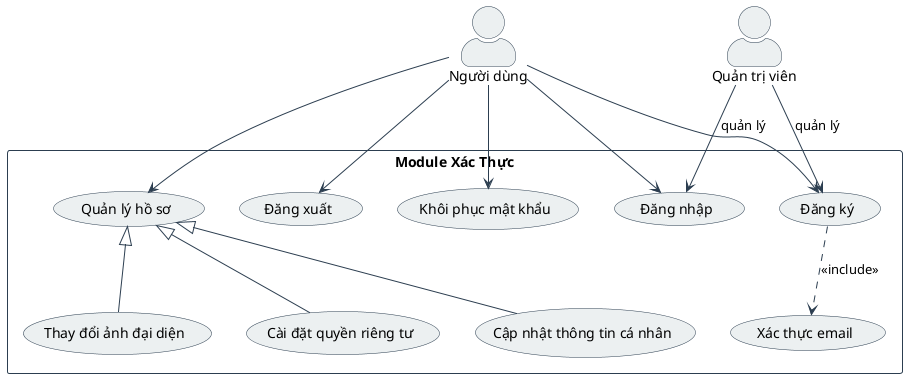
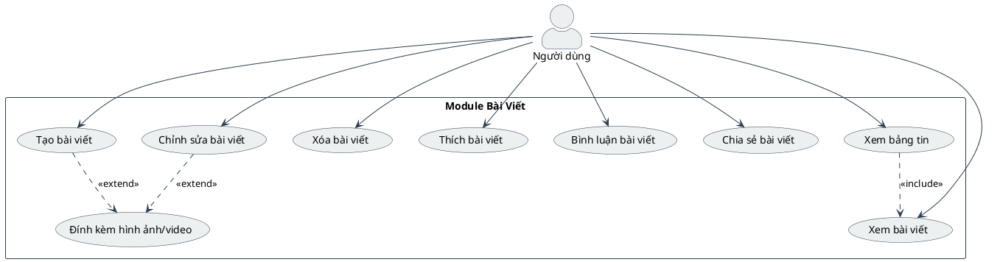
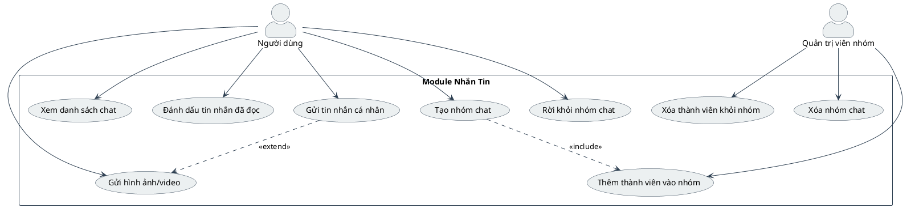
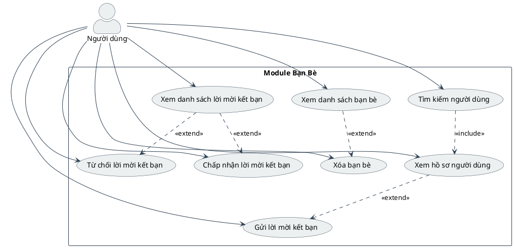
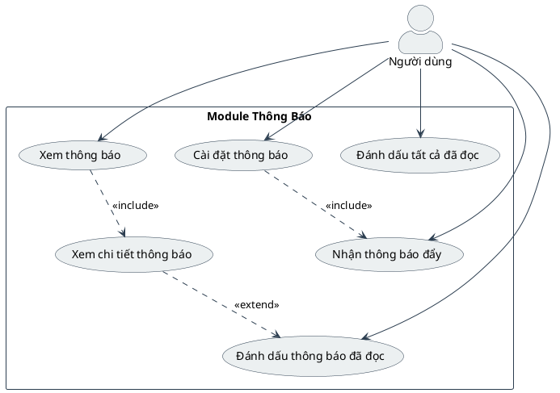

# Biểu Đồ Use Case Tổng Quát Cho Ứng Dụng Social App - PlantUML

Biểu đồ use case tổng quát này mô tả các chức năng chính của ứng dụng Social App và tương tác của người dùng với các chức năng đó, được tạo bằng PlantUML.

## Biểu Đồ Use Case Tổng Quát

```plantuml
@startuml
!define RECTANGLE class

skinparam actorStyle awesome
skinparam packageStyle rectangle
skinparam usecaseStyle roundbox
skinparam arrowColor #2C3E50
skinparam actorBorderColor #2C3E50
skinparam usecaseBorderColor #2C3E50
skinparam packageBorderColor #2C3E50
skinparam packageBackgroundColor #FFFFFF
skinparam usecaseBackgroundColor #ECF0F1
skinparam actorBackgroundColor #ECF0F1

actor "Người dùng" as User
actor "Quản trị viên" as Admin
actor "Quản trị viên nhóm" as GroupAdmin

rectangle "Social App" {
  ' Module Xác thực
  usecase "Quản lý tài khoản" as Authentication
  usecase "Đăng ký" as Register
  usecase "Đăng nhập" as Login
  usecase "Đăng xuất" as Logout
  usecase "Khôi phục mật khẩu" as ResetPassword
  usecase "Xác thực email" as VerifyEmail
  usecase "Quản lý hồ sơ" as Profile
  
  ' Module Bài viết
  usecase "Quản lý bài viết" as PostManagement
  usecase "Tạo bài viết" as CreatePost
  usecase "Chỉnh sửa bài viết" as EditPost
  usecase "Xóa bài viết" as DeletePost
  usecase "Thích bài viết" as LikePost
  usecase "Bình luận bài viết" as CommentPost
  usecase "Chia sẻ bài viết" as SharePost
  
  ' Module Bạn bè
  usecase "Quản lý bạn bè" as FriendManagement
  usecase "Tìm kiếm người dùng" as SearchUsers
  usecase "Gửi lời mời kết bạn" as SendFriendRequest
  usecase "Chấp nhận lời mời kết bạn" as AcceptFriendRequest
  usecase "Từ chối lời mời kết bạn" as RejectFriendRequest
  usecase "Xóa bạn bè" as RemoveFriend
  
  ' Module Nhắn tin
  usecase "Quản lý tin nhắn" as ChatManagement
  usecase "Gửi tin nhắn cá nhân" as SendMessage
  usecase "Gửi hình ảnh/video" as SendMedia
  usecase "Tạo nhóm chat" as CreateGroupChat
  usecase "Thêm thành viên vào nhóm" as AddMember
  usecase "Xóa thành viên khỏi nhóm" as RemoveMember
  usecase "Rời khỏi nhóm chat" as LeaveGroup
  usecase "Xóa nhóm chat" as DeleteGroup
  
  ' Module Thông báo
  usecase "Quản lý thông báo" as NotificationManagement
  usecase "Xem thông báo" as ViewNotifications
  usecase "Đánh dấu thông báo đã đọc" as MarkAsRead
  usecase "Đánh dấu tất cả đã đọc" as MarkAllAsRead
  usecase "Cài đặt thông báo" as NotificationSettings
}

' Mối quan hệ giữa actors và use cases
User --> Authentication
User --> PostManagement
User --> FriendManagement
User --> ChatManagement
User --> NotificationManagement

' Mối quan hệ giữa các use cases
Authentication <|-- Register
Authentication <|-- Login
Authentication <|-- Logout
Authentication <|-- ResetPassword
Authentication <|-- VerifyEmail
Authentication <|-- Profile

PostManagement <|-- CreatePost
PostManagement <|-- EditPost
PostManagement <|-- DeletePost
PostManagement <|-- LikePost
PostManagement <|-- CommentPost
PostManagement <|-- SharePost

FriendManagement <|-- SearchUsers
FriendManagement <|-- SendFriendRequest
FriendManagement <|-- AcceptFriendRequest
FriendManagement <|-- RejectFriendRequest
FriendManagement <|-- RemoveFriend

ChatManagement <|-- SendMessage
ChatManagement <|-- SendMedia
ChatManagement <|-- CreateGroupChat
ChatManagement <|-- AddMember
ChatManagement <|-- RemoveMember
ChatManagement <|-- LeaveGroup
ChatManagement <|-- DeleteGroup

NotificationManagement <|-- ViewNotifications
NotificationManagement <|-- MarkAsRead
NotificationManagement <|-- MarkAllAsRead
NotificationManagement <|-- NotificationSettings

' Mối quan hệ đặc biệt
GroupAdmin --> AddMember
GroupAdmin --> RemoveMember
GroupAdmin --> DeleteGroup
Admin --> Authentication

' Mối quan hệ mở rộng và bao gồm
SendMessage ..> SendMedia : <<extend>>
CreatePost ..> SharePost : <<extend>>
Register ..> VerifyEmail : <<include>>
@enduml
```

## Biểu Đồ Use Case Theo Từng Module

### 1. Module Xác Thực (Authentication)

### 2. Module Bài Viết (Posts)

### 3. Module Nhắn Tin (Chat)

### 4. Module Bạn Bè (Friends)

### 5. Module Thông Báo (Notifications)

## Mô Tả Chi Tiết Các Use Case

### 1. Quản lý Tài khoản (Authentication)
- **Đăng ký**: Người dùng tạo tài khoản mới với email và mật khẩu
- **Đăng nhập**: Người dùng đăng nhập vào hệ thống
- **Đăng xuất**: Người dùng đăng xuất khỏi hệ thống
- **Khôi phục mật khẩu**: Người dùng yêu cầu đặt lại mật khẩu
- **Xác thực email**: Người dùng xác nhận email để kích hoạt tài khoản
- **Quản lý hồ sơ**: Người dùng xem và cập nhật thông tin cá nhân

### 2. Quản lý Bài viết (Post Management)
- **Tạo bài viết mới**: Người dùng tạo bài viết mới với nội dung văn bản, hình ảnh hoặc video
- **Chỉnh sửa bài viết**: Người dùng chỉnh sửa bài viết đã đăng
- **Xóa bài viết**: Người dùng xóa bài viết đã đăng
- **Thích bài viết**: Người dùng thích bài viết của người khác
- **Bình luận bài viết**: Người dùng bình luận trên bài viết
- **Chia sẻ bài viết**: Người dùng chia sẻ bài viết với bạn bè
- **Xem bảng tin**: Người dùng xem bảng tin với các bài viết từ bạn bè

### 3. Quản lý Bạn bè (Friend Management)
- **Tìm kiếm người dùng**: Người dùng tìm kiếm người dùng khác
- **Gửi lời mời kết bạn**: Người dùng gửi lời mời kết bạn
- **Chấp nhận lời mời kết bạn**: Người dùng chấp nhận lời mời kết bạn
- **Từ chối lời mời kết bạn**: Người dùng từ chối lời mời kết bạn
- **Xóa bạn bè**: Người dùng xóa mối quan hệ bạn bè
- **Xem danh sách bạn bè**: Người dùng xem danh sách bạn bè của mình

### 4. Quản lý Tin nhắn (Chat Management)
- **Gửi tin nhắn cá nhân**: Người dùng gửi tin nhắn cho người dùng khác
- **Gửi hình ảnh/video**: Người dùng gửi hình ảnh hoặc video trong tin nhắn
- **Tạo nhóm chat**: Người dùng tạo nhóm chat mới
- **Thêm thành viên vào nhóm**: Quản trị viên nhóm thêm thành viên mới vào nhóm
- **Xóa thành viên khỏi nhóm**: Quản trị viên nhóm xóa thành viên khỏi nhóm
- **Rời khỏi nhóm chat**: Người dùng rời khỏi nhóm chat
- **Xóa nhóm chat**: Quản trị viên nhóm xóa nhóm chat

### 5. Quản lý Thông báo (Notification Management)
- **Xem thông báo**: Người dùng xem danh sách thông báo
- **Đánh dấu thông báo đã đọc**: Người dùng đánh dấu thông báo đã đọc
- **Đánh dấu tất cả đã đọc**: Người dùng đánh dấu tất cả thông báo đã đọc
- **Cài đặt thông báo**: Người dùng thiết lập cài đặt thông báo
- **Nhận thông báo đẩy**: Người dùng nhận thông báo đẩy từ ứng dụng 